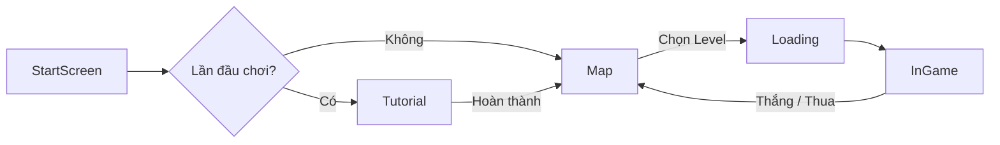
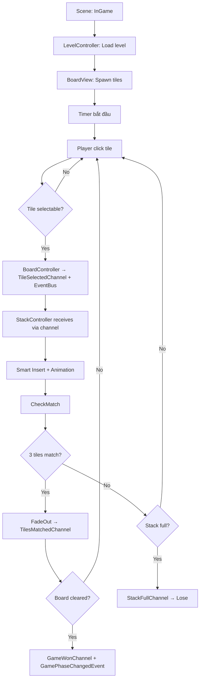
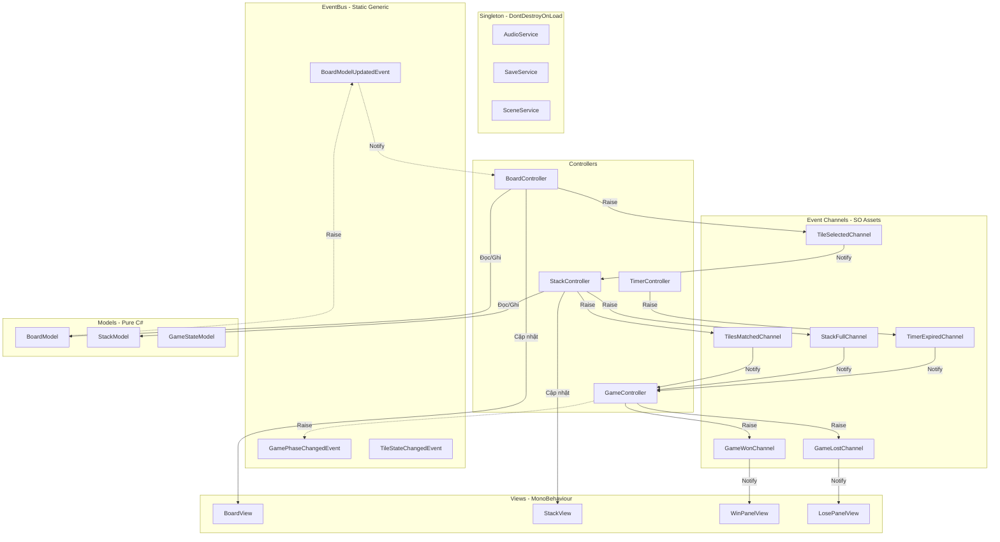

# 📖 Pirate Tiles — Tài Liệu Cấu Trúc & Cách Hoạt Động Dự Án

> **Dự án:** Pirate Tiles — Game giải đố xếp bài Match-3 Tile trên mobile  
> **Engine:** Unity 6 (C#)  
> **Thư viện bên ngoài:** DOTween, TextMesh Pro  
> **Kiến trúc:** MVC + Hybrid Event System (EventBus + Event Channel SO)  
> **Theme:** 🏴‍☠️ Cướp biển (Pirate)

---

## Mục lục

1. [Tổng quan dự án](#1-tổng-quan-dự-án)
2. [Cấu trúc thư mục](#2-cấu-trúc-thư-mục)
3. [Hệ thống Scene](#3-hệ-thống-scene)
4. [Kiến trúc mã nguồn](#4-kiến-trúc-mã-nguồn)
5. [Luồng hoạt động chính](#5-luồng-hoạt-động-chính)
6. [Hệ thống Event — Hybrid](#6-hệ-thống-event--hybrid)
7. [Hệ thống lưu trữ dữ liệu](#7-hệ-thống-lưu-trữ-dữ-liệu)
8. [Sơ đồ quan hệ giữa các thành phần](#8-sơ-đồ-quan-hệ-giữa-các-thành-phần)

---

## 1. Tổng quan dự án

**Pirate Tiles** là một tựa game giải đố 2D với chủ đề cướp biển. Người chơi chọn các lá bài (tiles) từ bàn cờ nhiều lớp để đưa vào khay chứa (stack). Khi 3 lá bài cùng loại xếp liền nhau trong khay, chúng sẽ match và biến mất. Mục tiêu là dọn sạch bàn cờ trong thời gian giới hạn.

### Tính năng chính

| Tính năng | Mô tả |
|---|---|
| **Match-3 Tile** | Ghép 3 lá bài cùng loại trong khay chứa |
| **Multi-layer Board** | Bàn cờ nhiều tầng, lá bài phía trên che lá dưới |
| **4 Power-ups** | Undo, Magic, Shuffle, Add One Cell |
| **Hearts System** | Mạng sống, tự hồi phục theo thời gian |
| **Coins System** | Tiền tệ trong game |
| **Timer** | Đếm ngược mỗi màn chơi |

---

## 2. Cấu trúc thư mục

```
Pirate-Tiles/
├── Assets/
│   ├── _Project/                       # ⭐ Mã nguồn chính
│   │   ├── Scripts/
│   │   │   ├── Models/                # 🟦 Model Layer (Pure C#)
│   │   │   │
│   │   │   ├── Views/                 # 🟩 View Layer (MonoBehaviour)
│   │   │   │
│   │   │   ├── Controllers/           # 🟧 Controller Layer
│   │   │   │
│   │   │   ├── Services/              # 🟪 Singleton Services
│   │   │   │
│   │   │   ├── Data/                  # 🟫 Data Layer
│   │   │   │   ├── Enums/
│   │   │   │   ├── Constants/
│   │   │   │   ├── EventBus/          # ⚡ EventBus (Static Generic)
│   │   │   │   │   ├── EventBus.cs
│   │   │   │   │   ├── EventBinding.cs
│   │   │   │   │   ├── IEvent.cs
│   │   │   │   │   ├── EventBusUtil.cs
│   │   │   │   │   ├── PredefinedAssemblyUtil.cs
│   │   │   │   │   └── Events/        # Event struct definitions
│   │   │   │   │       ├── GameEvents.cs
│   │   │   │   │       ├── TileEvents.cs
│   │   │   │   │       └── AudioEvents.cs
│   │   │   │   ├── EventChannels/     # 📡 Event Channel SO
│   │   │   │   │   ├── EventChannelSO.cs
│   │   │   │   │   ├── EventListener.cs
│   │   │   │   │   ├── VoidEventChannelSO.cs
│   │   │   │   │   ├── BoolEventChannelSO.cs
│   │   │   │   │   ├── IntEventChannelSO.cs
│   │   │   │   │   └── TileSelectedChannelSO.cs
│   │   │   │   ├── EventData/         # 📦 Struct payloads
│   │   │   │   │   ├── TileSelectedEventData.cs
│   │   │   │   │   └── PowerUpUsedEventData.cs
│   │   │   │   └── ScriptableObjects/
│   │   │   │
│   │   │   ├── Utils/
│   │   │   └── Editor/
│   │   │
│   │   ├── Scenes/
│   │   ├── Prefabs/
│   │   └── Resources/
│   │       ├── EventChannels/         # ⭐ Event Channel SO assets
│   │       └── ...
│   │
│   ├── Plugins/
│   └── Documents/                     # 📄 Tài liệu dự án
│
├── Packages/
└── ProjectSettings/
```

---

## 3. Hệ thống Scene



| Scene | Vai trò |
|---|---|
| `StartScreen` | Màn hình bắt đầu game |
| `Tutorial` | Hướng dẫn cách chơi |
| `Map` | Bản đồ hải tặc — chọn level |
| `Loading` | Loading screen async |
| `InGame` | Scene gameplay chính |

---

## 4. Kiến trúc mã nguồn

### 4.1 Data Layer

| File/Folder | Nội dung |
|---|---|
| `Enums/` | CardType, CardState, PowerType, GamePhase, SoundEffect |
| `Constants/` | SaveKeys |
| `EventBus/` | Static generic EventBus infrastructure + event structs |
| `EventChannels/` | ScriptableObject-based event channels |
| `EventData/` | Struct payloads cho Event Channels |
| `ScriptableObjects/` | TileDatabaseSO, LevelConfigSO, GameConfigSO, AudioConfigSO |

### 4.2 Model Layer — Pure C#

| Model | Trách nhiệm |
|---|---|
| `TileModel` | Dữ liệu 1 tile |
| `BoardModel` | Quản lý tất cả tiles, overlap detection |
| `StackModel` | Khay chứa: smart insert, match-3 |
| `GameStateModel` | Game phase, CanInteract |
| `PowerUpModel` | Đếm lượt power-up |
| `HeartsModel` | Mạng sống, heal timer |
| `CoinsModel` | Tiền tệ |

### 4.3 View Layer — MonoBehaviour

| View | Trách nhiệm |
|---|---|
| `TileView` | Render sprite, animation |
| `BoardView` | Spawn/despawn tiles |
| `StackView` | Render stack, animation |
| UI Views | WinPanel, LosePanel, Timer, Hearts, Coins, PowerUp, Map |

### 4.4 Controller Layer

| Controller | Trách nhiệm |
|---|---|
| `GameController` | Điều phối trung tâm, dùng cả EventBus + Event Channel |
| `BoardController` | Click tile, raise TileSelectedChannel, listen EventBus |
| `StackController` | Nhận tile via channel, match detection |
| `AudioController` | Subscribe cả hai hệ thống → play sounds |

### 4.5 Services Layer

| Service | Trách nhiệm |
|---|---|
| `AudioService` | Singleton — BGM, SFX |
| `SaveService` | Singleton — PlayerPrefs wrapper |
| `SceneService` | Singleton — Async scene loading |

---

## 5. Luồng hoạt động chính



---

## 6. Hệ thống Event — Hybrid

Dự án sử dụng **2 hệ thống event** song song:

### 6.1 EventBus Events (Static Generic — Internal/System-Level)

| Event | Payload | Mô tả |
|---|---|---|
| `GamePhaseChangedEvent` | PreviousPhase, NewPhase | Game phase transition |
| `TileStateChangedEvent` | TileId, PreviousState, NewState | Tile state internal |
| `BoardModelUpdatedEvent` | RemainingTiles, SelectableTiles | Board model sync |
| `SceneLoadRequestedEvent` | SceneName, UseLoadingScreen | Scene load request |
| `SaveDataChangedEvent` | Key | Save data notification |
| `AudioSettingChangedEvent` | IsMusicEnabled, IsSfxEnabled | Audio setting change |

### 6.2 Event Channel SO (ScriptableObject — Cross-Layer/Inspector)

| Event Channel | Params | Publisher | Subscriber |
|---|---|---|---|
| `TileSelectedChannel` | `TileSelectedEventData` | `BoardController` | `StackController` |
| `TilesMatchedChannel` | void | `StackController` | `GameController`, `AudioController` |
| `GameWonChannel` | void | `GameController` | `WinPanelView`, `AudioController` |
| `GameLostChannel` | void | `GameController` | `LosePanelView`, `AudioController` |
| `GamePausedChannel` | `bool` | `GameController` | `TimerController`, `AudioController` |
| `TimerExpiredChannel` | void | `TimerController` | `GameController` |
| `StackFullChannel` | void | `StackController` | `GameController` |
| `BoardClearedChannel` | void | `BoardController` | `GameController` |
| `UndoRequestChannel` | void | `PowerUpController` | `BoardController`, `StackController` |
| `CoinsChangedChannel` | `int` | `CoinsController` | `CoinsView` |
| `HeartsChangedChannel` | `int` | `HeartsController` | `HeartsView` |
| `SpendCoinsRequestChannel` | `PowerType` | `PowerUpController` | `CoinsController` |
| `OutOfHeartsChannel` | void | `HeartsController` | `OutOfHeartPanelView` |

---

## 7. Hệ thống lưu trữ dữ liệu

Toàn bộ dữ liệu persistent được lưu qua **SaveService** (wrapper PlayerPrefs).

| Key | Kiểu | Mô tả | Mặc định |
|---|---|---|---|
| `Coins` | int | Số coins | 0 |
| `Hearts` | int | Số hearts | 3 |
| `LastHealTimestamp` | string | Timestamp heal cuối | UTC Now |
| `UndoPowerCount` | int | Lượt Undo | 3 |
| `MagicPowerCount` | int | Lượt Magic | 3 |
| `ShufflePowerCount` | int | Lượt Shuffle | 3 |
| `AddOneCellPowerCount` | int | Lượt AddOneCell | 3 |
| `UnlockedLevels` | int | Level cao nhất mở khóa | 1 |
| `LevelStars_{n}` | int | Sao đạt tại level n | 0 |
| `MusicToggle` | int (0/1) | Music on/off | 1 |
| `SFXToggle` | int (0/1) | SFX on/off | 1 |

---

## 8. Sơ đồ quan hệ giữa các thành phần



---

> **Ghi chú:** Pirate Tiles sử dụng **hệ thống event hybrid**: EventBus (static generic, nét đứt `-.->`) cho sự kiện nội bộ/system-level + Event Channel SO (nét liền `-->`) cho sự kiện cross-layer. Mỗi event payload dùng **struct**.
