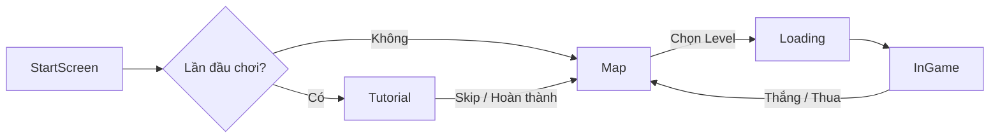
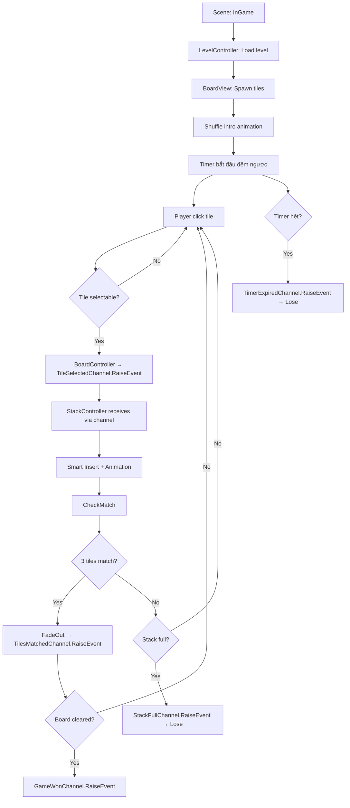
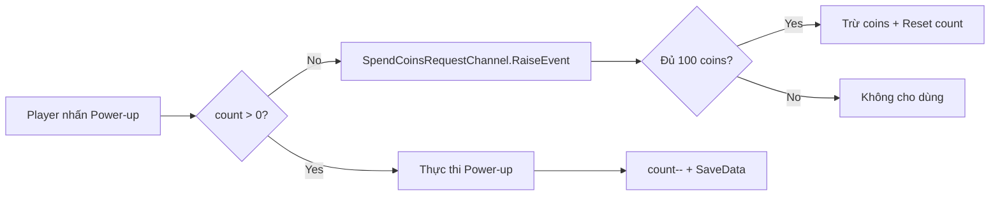
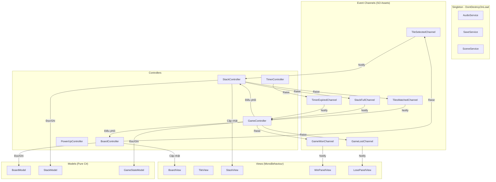

# 📖 Pirate Tiles — Tài Liệu Cấu Trúc & Cách Hoạt Động Dự Án

> **Dự án:** Pirate Tiles — Game giải đố xếp bài Match-3 Tile trên mobile  
> **Engine:** Unity 6 (C#)  
> **Thư viện bên ngoài:** DOTween, TextMesh Pro  
> **Kiến trúc:** MVC + Event Channel (ScriptableObject-based)  
> **Theme:** 🏴‍☠️ Cướp biển (Pirate)

---

## Mục lục

1. [Tổng quan dự án](#1-tổng-quan-dự-án)
2. [Cấu trúc thư mục](#2-cấu-trúc-thư-mục)
3. [Hệ thống Scene](#3-hệ-thống-scene)
4. [Kiến trúc mã nguồn](#4-kiến-trúc-mã-nguồn)
5. [Luồng hoạt động chính](#5-luồng-hoạt-động-chính)
6. [Hệ thống Event Channel](#6-hệ-thống-event-channel)
7. [Hệ thống lưu trữ dữ liệu](#7-hệ-thống-lưu-trữ-dữ-liệu)
8. [Sơ đồ quan hệ giữa các thành phần](#8-sơ-đồ-quan-hệ-giữa-các-thành-phần)

---

## 1. Tổng quan dự án

**Pirate Tiles** là một tựa game giải đố 2D với chủ đề cướp biển. Người chơi chọn các lá bài (tiles) từ bàn cờ nhiều lớp để đưa vào khay chứa (stack). Khi 3 lá bài cùng loại xếp liền nhau trong khay, chúng sẽ match và biến mất. Mục tiêu là dọn sạch bàn cờ trong thời gian giới hạn.

### Tính năng chính

| Tính năng | Mô tả |
|---|---|
| **Match-3 Tile** | Ghép 3 lá bài cùng loại trong khay chứa |
| **Multi-layer Board** | Bàn cờ nhiều tầng, lá bài phía trên che lá dưới |
| **4 Power-ups** | Undo, Magic, Shuffle, Add One Cell |
| **Hearts System** | Mạng sống, tự hồi phục theo thời gian |
| **Coins System** | Tiền tệ trong game |
| **Timer** | Đếm ngược mỗi màn chơi |
| **Star Rating** | Đánh giá sao cho mỗi màn |
| **Level Map** | Bản đồ hải tặc chọn màn |
| **Level Editor** | Công cụ thiết kế màn chơi |
| **Collectible Cards** | Lá bài đặc biệt thu thập |

---

## 2. Cấu trúc thư mục

```
Pirate-Tiles/
├── Assets/
│   ├── _PirateTiles/                  # ⭐ Mã nguồn chính
│   │   ├── Scripts/
│   │   │   ├── Models/                # 🟦 Model Layer (Pure C#)
│   │   │   │   ├── TileModel.cs
│   │   │   │   ├── BoardModel.cs
│   │   │   │   ├── StackModel.cs
│   │   │   │   ├── LevelModel.cs
│   │   │   │   ├── PowerUpModel.cs
│   │   │   │   ├── HeartsModel.cs
│   │   │   │   ├── CoinsModel.cs
│   │   │   │   ├── TileHistoryModel.cs
│   │   │   │   └── GameStateModel.cs
│   │   │   │
│   │   │   ├── Views/                 # 🟩 View Layer (MonoBehaviour)
│   │   │   │   ├── Tile/
│   │   │   │   │   ├── TileView.cs
│   │   │   │   │   └── TileVFXView.cs
│   │   │   │   ├── Board/
│   │   │   │   │   └── BoardView.cs
│   │   │   │   ├── Stack/
│   │   │   │   │   └── StackView.cs
│   │   │   │   ├── UI/
│   │   │   │   │   ├── WinPanelView.cs
│   │   │   │   │   ├── LosePanelView.cs
│   │   │   │   │   ├── SettingPanelView.cs
│   │   │   │   │   ├── HeartsView.cs
│   │   │   │   │   ├── CoinsView.cs
│   │   │   │   │   ├── PowerUpBarView.cs
│   │   │   │   │   ├── TimerView.cs
│   │   │   │   │   ├── MapView.cs
│   │   │   │   │   ├── LoadingView.cs
│   │   │   │   │   ├── OutOfHeartPanelView.cs
│   │   │   │   │   └── SpendCoinsPanelView.cs
│   │   │   │   └── Tutorial/
│   │   │   │       └── TutorialView.cs
│   │   │   │
│   │   │   ├── Controllers/           # 🟧 Controller Layer
│   │   │   │   ├── GameController.cs
│   │   │   │   ├── BoardController.cs
│   │   │   │   ├── StackController.cs
│   │   │   │   ├── PowerUpController.cs
│   │   │   │   ├── TimerController.cs
│   │   │   │   ├── LevelController.cs
│   │   │   │   ├── HeartsController.cs
│   │   │   │   ├── CoinsController.cs
│   │   │   │   ├── TutorialController.cs
│   │   │   │   └── AudioController.cs
│   │   │   │
│   │   │   ├── Services/              # 🟪 Singleton Services
│   │   │   │   ├── AudioService.cs
│   │   │   │   ├── SaveService.cs
│   │   │   │   └── SceneService.cs
│   │   │   │
│   │   │   ├── Data/                  # 🟫 Enums, Event Channels, SO
│   │   │   │   ├── Enums/
│   │   │   │   │   ├── TileType.cs
│   │   │   │   │   ├── TileState.cs
│   │   │   │   │   ├── PowerType.cs
│   │   │   │   │   ├── SoundEffect.cs
│   │   │   │   │   └── GamePhase.cs
│   │   │   │   ├── EventChannels/
│   │   │   │   │   ├── VoidEventChannelSO.cs
│   │   │   │   │   ├── EventChannelSO.cs
│   │   │   │   │   ├── TileSelectedChannelSO.cs
│   │   │   │   │   ├── BoolEventChannelSO.cs
│   │   │   │   │   └── IntEventChannelSO.cs
│   │   │   │   ├── EventData/
│   │   │   │   │   ├── TileSelectedEventData.cs
│   │   │   │   │   └── PowerUpUsedEventData.cs
│   │   │   │   ├── ScriptableObjects/
│   │   │   │   │   ├── TileDatabaseSO.cs
│   │   │   │   │   ├── LevelConfigSO.cs
│   │   │   │   │   ├── GameConfigSO.cs
│   │   │   │   │   └── AudioConfigSO.cs
│   │   │   │   └── SaveKeys.cs
│   │   │   │
│   │   │   ├── Utils/                 # 🔧 Tiện ích
│   │   │   │   ├── Extensions/
│   │   │   │   │   └── DOTweenExtensions.cs
│   │   │   │   └── Helpers/
│   │   │   │       └── ShuffleHelper.cs
│   │   │   │
│   │   │   ├── Editor/               # 🛠️ Editor tools
│   │   │   │   ├── LevelEditorWindow.cs
│   │   │   │   └── TileLevelEditor.cs
│   │   │   │
│   │   │   └── Tests/
│   │   │       ├── EditMode/
│   │   │       └── PlayMode/
│   │   │
│   │   ├── Scenes/
│   │   │   ├── StartScreen.unity
│   │   │   ├── InGame.unity
│   │   │   ├── Loading.unity
│   │   │   ├── Map.unity
│   │   │   └── Tutorial.unity
│   │   │
│   │   ├── Prefabs/
│   │   │   ├── Tile.prefab
│   │   │   ├── UI/
│   │   │   └── Managers/
│   │   │
│   │   ├── Resources/
│   │   │   ├── TileData/              # TileDatabaseSO assets
│   │   │   ├── LevelConfigs/
│   │   │   ├── LevelPrefabs/
│   │   │   ├── EventChannels/         # ⭐ Event Channel SO assets
│   │   │   └── GameConfig.asset
│   │   │
│   │   ├── Art/
│   │   ├── Audio/
│   │   ├── Materials/
│   │   └── Shaders/
│   │
│   ├── Plugins/                       # DOTween, TextMesh Pro
│   ├── TextMesh Pro/
│   └── Documents/                     # 📄 Tài liệu dự án
│
├── Packages/
└── ProjectSettings/
```

---

## 3. Hệ thống Scene



| Scene | Vai trò |
|---|---|
| `StartScreen` | Màn hình bắt đầu game |
| `Tutorial` | Hướng dẫn cách chơi |
| `Map` | Bản đồ hải tặc — chọn level |
| `Loading` | Loading screen async |
| `InGame` | Scene gameplay chính |

### Cơ chế chuyển Scene

`SceneService` (Singleton, DontDestroyOnLoad):
1. Kill tất cả DOTween animation
2. Reset `Time.timeScale = 1`
3. Load scene `Loading` trước
4. Load async scene đích

---

## 4. Kiến trúc mã nguồn

### 4.1 Data Layer — Enums, Event Channels, ScriptableObjects

| File/Folder | Nội dung |
|---|---|
| `TileType` | Enum 13 loại tile pirate + 4 special |
| `TileState` | Enum: `InBoard`, `InStack` |
| `PowerType` | Enum: `Undo`, `Magic`, `Shuffle`, `AddOneCell` |
| `SaveKeys` | Hằng số key cho PlayerPrefs |
| `EventChannels/` | Base + typed Event Channel ScriptableObjects |
| `EventData/` | Data structs cho Event Channels |
| `TileDatabaseSO` | Mảng TileData (TileType + Sprite) |
| `LevelConfigSO` | Cấu hình level |
| `GameConfigSO` | Cấu hình game chung |

### 4.2 Model Layer — Pure C#

| Model | Trách nhiệm |
|---|---|
| `TileModel` | Dữ liệu 1 tile: type, state, position, layer, selectable |
| `BoardModel` | Quản lý tất cả tiles, overlap detection, shuffle, win check |
| `StackModel` | Khay chứa: smart insert, match-3, full check |
| `GameStateModel` | Game phase, processing flags, CanInteract |
| `TileHistoryModel` | Lịch sử chọn tile (stack pattern) cho Undo |
| `PowerUpModel` | Đếm lượt power-up |
| `HeartsModel` | Mạng sống, heal timer, offline recovery |
| `CoinsModel` | Tiền tệ |

### 4.3 View Layer — MonoBehaviour

| View | Trách nhiệm |
|---|---|
| `TileView` | Render sprite, dim/brighten, animation di chuyển, dissolve |
| `BoardView` | Spawn/despawn tiles, sync selectable visual |
| `StackView` | Render stack, animation add/remove/arrange |
| `WinPanelView` | UI thắng + animation |
| `LosePanelView` | UI thua + animation |
| `TimerView` | Countdown display |
| `PowerUpBarView` | 4 nút power-up |
| `HeartsView` | Hearts display + heal countdown |
| `CoinsView` | Coins display |
| `MapView` | Bản đồ hải tặc, stars, lock/unlock |

### 4.4 Controller Layer

| Controller | Trách nhiệm |
|---|---|
| `GameController` | Điều phối trung tâm — game phase, win/lose flow |
| `BoardController` | Click tile, overlap check, sync view, raise TileSelectedChannel |
| `StackController` | Nhận tile via channel, match detection, remove, arrange |
| `PowerUpController` | Xử lý 4 power-ups |
| `TimerController` | Countdown, raise TimerExpiredChannel |
| `LevelController` | Load level, unlock progress |
| `HeartsController` | Hearts logic, heal timer |
| `CoinsController` | Earn/spend coins |
| `AudioController` | Subscribe channels → play sounds |

### 4.5 Services Layer

| Service | Trách nhiệm |
|---|---|
| `AudioService` | Singleton — BGM, SFX qua AudioMixer |
| `SaveService` | Singleton — PlayerPrefs wrapper |
| `SceneService` | Singleton — Async scene loading |

---

## 5. Luồng hoạt động chính

### 5.1 Gameplay Loop



### 5.2 Power-up Flow



---

## 6. Hệ thống Event Channel

Dự án sử dụng **Event Channel (ScriptableObject-based)** thay vì static EventBus. Mỗi event là một SO asset, wire qua `[SerializeField]` trong Inspector.

### Bảng Event Channels

| Event Channel | Params | Publisher | Subscriber |
|---|---|---|---|
| `TileSelectedChannel` | `TileSelectedEventData` | `BoardController` | `StackController` |
| `TilesMatchedChannel` | void | `StackController` | `GameController`, `AudioController` |
| `GameWonChannel` | void | `GameController` | `WinPanelView`, `AudioController`, `CoinsController` |
| `GameLostChannel` | void | `GameController` | `LosePanelView`, `AudioController` |
| `GamePausedChannel` | `bool` | `GameController` | `TimerController`, `AudioController` |
| `TimerExpiredChannel` | void | `TimerController` | `GameController` |
| `StackFullChannel` | void | `StackController` | `GameController` |
| `BoardClearedChannel` | void | `BoardController` | `GameController` |
| `UndoRequestChannel` | void | `PowerUpController` | `BoardController`, `StackController` |
| `CoinsChangedChannel` | `int` | `CoinsController` | `CoinsView` |
| `HeartsChangedChannel` | `int` | `HeartsController` | `HeartsView` |
| `SpendCoinsRequestChannel` | `PowerType` | `PowerUpController` | `CoinsController` |
| `ShuffleCompletedChannel` | void | `BoardController` | `TimerController` |
| `OutOfHeartsChannel` | void | `HeartsController` | `OutOfHeartPanelView` |

---

## 7. Hệ thống lưu trữ dữ liệu

Toàn bộ dữ liệu persistent được lưu qua **SaveService** (wrapper PlayerPrefs).

| Key | Kiểu | Mô tả | Mặc định |
|---|---|---|---|
| `Coins` | int | Số coins | 0 |
| `Hearts` | int | Số hearts | 3 |
| `LastHealTimestamp` | string | Timestamp heal cuối | UTC Now |
| `UndoPowerCount` | int | Lượt Undo | 3 |
| `MagicPowerCount` | int | Lượt Magic | 3 |
| `ShufflePowerCount` | int | Lượt Shuffle | 3 |
| `AddOneCellPowerCount` | int | Lượt AddOneCell | 3 |
| `UnlockedLevels` | int | Level cao nhất mở khóa | 1 |
| `LevelStars_{n}` | int | Sao đạt tại level n | 0 |
| `MusicToggle` | int (0/1) | Music on/off | 1 |
| `SFXToggle` | int (0/1) | SFX on/off | 1 |
| `HasSeenTutorial` | int (0/1) | Đã xem tutorial | 0 |
| `STile{n}` | int (0/1) | Special tile đã thu thập | 0 |

---

## 8. Sơ đồ quan hệ giữa các thành phần



---

> **Ghi chú:** Pirate Tiles sử dụng **Event Channel SO** thay vì EventBus static. Mỗi event là một ScriptableObject asset trong `Resources/EventChannels/`, wire qua Inspector, dễ debug và giảm coupling giữa các thành phần.
