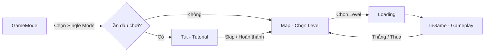
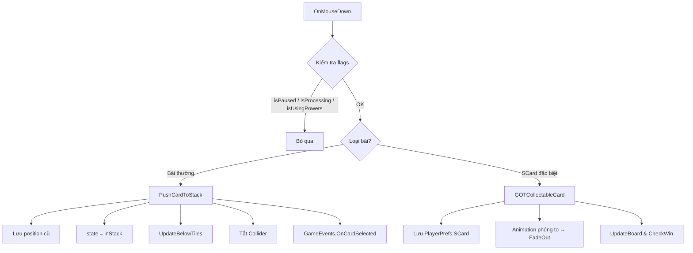
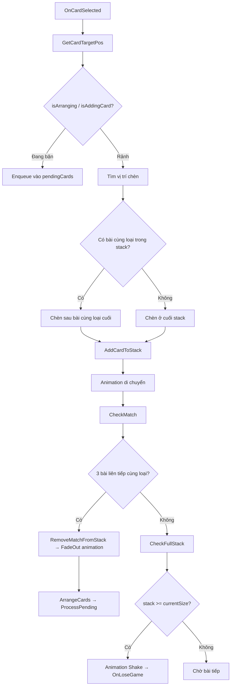
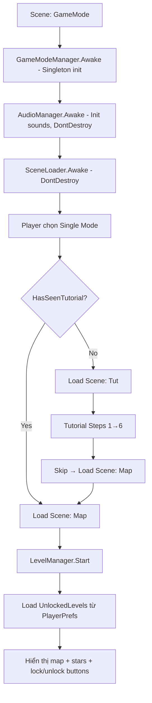
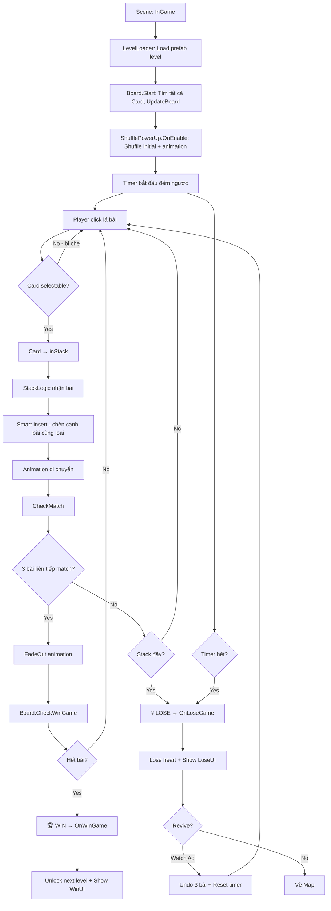
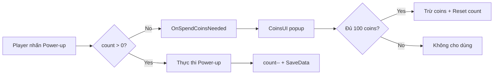
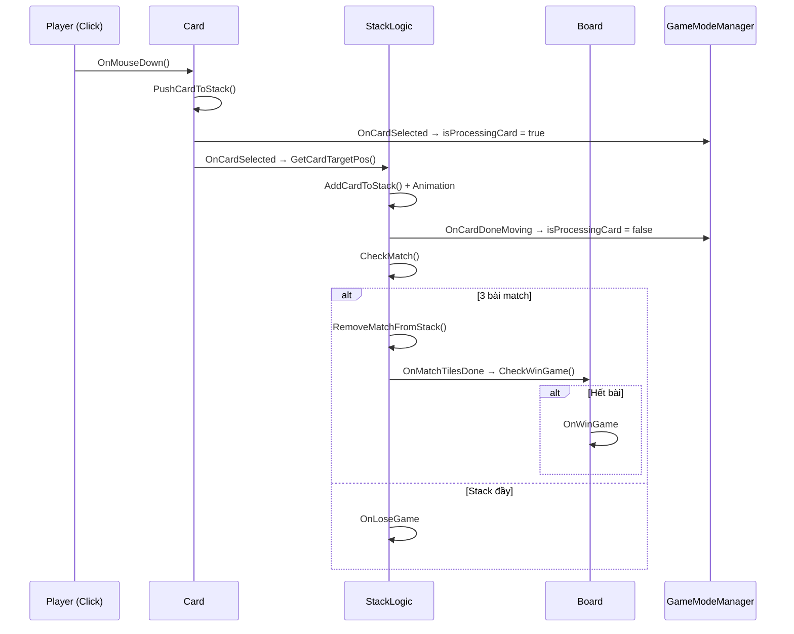
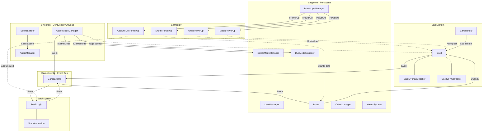

# 📖 Wonder Match — Tài Liệu Cấu Trúc & Cách Hoạt Động Dự Án

> **Dự án:** Wonder Match — Game giải đố xếp bài Match-3 trên mobile  
> **Engine:** Unity (C#)  
> **Thư viện bên ngoài:** DOTween, TextMesh Pro  
> **Thời gian phát triển:** 03/2025 – 05/2025  
> **Team:** CLB Nhà Sáng Tạo Game PTIT

---

## Mục lục

1. [Tổng quan dự án](#1-tổng-quan-dự-án)
2. [Cấu trúc thư mục](#2-cấu-trúc-thư-mục)
3. [Hệ thống Scene](#3-hệ-thống-scene)
4. [Kiến trúc mã nguồn](#4-kiến-trúc-mã-nguồn)
   - 4.1 [Const — Hằng số & Enum](#41-const--hằng-số--enum)
   - 4.2 [Core — Lõi hệ thống](#42-core--lõi-hệ-thống)
   - 4.3 [CardSystem — Hệ thống lá bài](#43-cardsystem--hệ-thống-lá-bài)
   - 4.4 [StackSystem — Hệ thống khay chứa](#44-stacksystem--hệ-thống-khay-chứa)
   - 4.5 [Gameplay — Power-ups & Coins](#45-gameplay--power-ups--coins)
   - 4.6 [Player — Người chơi](#46-player--người-chơi)
   - 4.7 [UI — Giao diện người dùng](#47-ui--giao-diện-người-dùng)
   - 4.8 [AnimatorScripts — Hệ thống Animation](#48-animatorscripts--hệ-thống-animation)
   - 4.9 [Tool — Công cụ thiết kế level](#49-tool--công-cụ-thiết-kế-level)
   - 4.10 [EDITOR — Level Editor](#410-editor--level-editor)
5. [Luồng hoạt động chính](#5-luồng-hoạt-động-chính)
6. [Hệ thống sự kiện (Event System)](#6-hệ-thống-sự-kiện-event-system)
7. [Hệ thống lưu trữ dữ liệu](#7-hệ-thống-lưu-trữ-dữ-liệu)
8. [Sơ đồ quan hệ giữa các thành phần](#8-sơ-đồ-quan-hệ-giữa-các-thành-phần)

---

## 1. Tổng quan dự án

**Wonder Match** là một tựa game giải đố 2D, người chơi chọn các lá bài từ bàn cờ nhiều lớp (multi-layer board) để đưa vào khay chứa (stack). Khi 3 lá bài cùng loại xếp liền nhau trong khay, chúng sẽ được ghép (match) và biến mất. Mục tiêu là dọn sạch toàn bộ bàn cờ trong thời gian giới hạn.

### Tính năng chính

| Tính năng | Mô tả |
|---|---|
| **Match-3 Tile** | Ghép 3 lá bài cùng loại trong khay chứa |
| **Multi-layer Board** | Bàn cờ nhiều tầng, lá bài phía trên che lá bài phía dưới |
| **4 Power-ups** | Undo, Magic, Shuffle, Add One Cell |
| **Hearts System** | Hệ thống mạng sống, tự hồi phục theo thời gian |
| **Coins System** | Tiền tệ trong game, kiếm được khi thắng |
| **Timer** | Đếm ngược thời gian mỗi màn chơi |
| **Star Rating** | Đánh giá sao cho mỗi màn |
| **Level Map** | Bản đồ chọn màn chơi |
| **Tutorial** | Hướng dẫn người chơi mới |
| **Level Editor** | Công cụ thiết kế màn chơi trong Unity Editor |
| **Collectible Cards** | Lá bài đặc biệt thu thập được (SCard) |

---

## 2. Cấu trúc thư mục

```
Team1-WonderMatch/
├── Assets/
│   ├── Scripts/                    # ⭐ Mã nguồn chính
│   │   ├── AnimatorScripts/        #    Animation cho lá bài
│   │   │   ├── CardAnimation.cs
│   │   │   └── GearSpin.cs
│   │   ├── CardSystem/             #    Hệ thống lá bài
│   │   │   ├── Board.cs
│   │   │   ├── Card.cs
│   │   │   ├── CardHistory.cs
│   │   │   └── CardOverlapChecker.cs
│   │   ├── Const/                  #    Enum & hằng số
│   │   │   ├── CardState.cs
│   │   │   ├── CardType.cs
│   │   │   ├── GameEvents.cs
│   │   │   ├── PlayerID.cs
│   │   │   ├── PowerType.cs
│   │   │   ├── SavedData.cs
│   │   │   └── SoundEffect.cs
│   │   ├── Core/                   #    Lõi hệ thống
│   │   │   ├── AudioManager.cs
│   │   │   ├── ButtonLvObj.cs
│   │   │   ├── CardDatabase.cs
│   │   │   ├── CustomAnimation.cs
│   │   │   ├── DuoModeManager.cs
│   │   │   ├── GameModeManager.cs
│   │   │   ├── HeartsSystem.cs
│   │   │   ├── IGameMode.cs
│   │   │   ├── LevelLoader.cs
│   │   │   ├── LevelManager.cs
│   │   │   ├── SingleModeManager.cs
│   │   │   └── UIButtonHandler.cs
│   │   ├── Gameplay/               #    Logic Power-ups & Coins
│   │   │   ├── AddOneCellPowerUp.cs
│   │   │   ├── CoinsManager.cs
│   │   │   ├── MagicPowerUp.cs
│   │   │   ├── PowerUpsManager.cs
│   │   │   ├── ShufflePowerUp.cs
│   │   │   └── UndoPowerUp.cs
│   │   ├── Player/                 #    Quản lý người chơi
│   │   │   ├── Player.cs
│   │   │   └── PlayerManager.cs
│   │   ├── StackSystem/            #    Hệ thống khay chứa
│   │   │   ├── StackAnimation.cs
│   │   │   └── StackLogic.cs
│   │   ├── Tool/                   #    Công cụ hỗ trợ
│   │   │   ├── BuildLayer.cs
│   │   │   └── Cell.cs
│   │   ├── UI/                     #    Giao diện người dùng
│   │   │   ├── BookmarkUI.cs
│   │   │   ├── CoinsUI.cs
│   │   │   ├── CoinsUIUpdater.cs
│   │   │   ├── CollectiblePopUpUI.cs
│   │   │   ├── MapLevelStarUI.cs
│   │   │   ├── MapSettingPanel.cs
│   │   │   ├── MusicAndSoundHandler.cs
│   │   │   ├── OutOfHeartPanel.cs
│   │   │   ├── PreviousAndNextButtonUI.cs
│   │   │   ├── SceneLoader.cs
│   │   │   ├── SettingButtonUI.cs
│   │   │   ├── SettingPanel.cs
│   │   │   ├── TimerPanel.cs
│   │   │   └── WinLosePanel.cs
│   │   ├── CardVFXController.cs    #    Hiệu ứng VFX cho lá bài
│   │   ├── ClickTrigger.cs
│   │   ├── Scaler.cs
│   │   ├── Tutorial.cs             #    Hướng dẫn người chơi
│   │   └── UIButtonTrigger.cs
│   │
│   ├── EDITOR/                     # ⭐ Editor Tools (chỉ chạy trong Unity Editor)
│   │   ├── CardLevelEditor.cs
│   │   └── LevelEditor.cs
│   │
│   ├── Scenes/                     # ⭐ Các Scene
│   │   ├── GameMode.unity
│   │   ├── InGame.unity
│   │   ├── LevelEditor.unity
│   │   ├── Loading.unity
│   │   ├── Map.unity
│   │   └── Tut.unity
│   │
│   ├── Prefabs/                    #    Các Prefab
│   ├── Resources/                  #    Tài nguyên load động
│   │   ├── CardData/               #    ScriptableObject dữ liệu bài
│   │   ├── LevelPrefabs/           #    Prefab các màn chơi
│   │   └── MapPrefab/              #    Prefab bản đồ
│   │
│   ├── Art/                        #    Tài nguyên đồ họa
│   ├── Art Assets/                 #    Asset đồ họa bổ sung
│   ├── Audio/                      #    Âm thanh & nhạc nền
│   ├── Plugins/                    #    Plugin (DOTween, v.v.)
│   ├── Settings/                   #    Cài đặt render pipeline
│   ├── shader/                     #    Custom shader
│   └── matterial/                  #    Material
│
├── Packages/                       #    Unity Package Manager
├── ProjectSettings/                #    Cấu hình dự án Unity
└── README.md
```

---

## 3. Hệ thống Scene

Dự án sử dụng **6 Scene** với luồng chuyển đổi như sau:



| Scene | Vai trò |
|---|---|
| `GameMode` | Chọn chế độ chơi (Single / Duo) |
| `Tut` | Hướng dẫn cách chơi cho người mới |
| `Map` | Bản đồ chọn màn chơi, hiển thị sao đã đạt |
| `Loading` | Màn hình chuyển cảnh, load async scene tiếp theo |
| `InGame` | Scene gameplay chính |
| `LevelEditor` | Scene dành cho dev thiết kế level |

### Cơ chế chuyển Scene

`SceneLoader` (Singleton, DontDestroyOnLoad) chịu trách nhiệm chuyển scene:
1. Kill tất cả DOTween animation
2. Reset `Time.timeScale = 1`
3. Load scene `Loading` trước (hiển thị loading screen)
4. Load async scene đích, chờ `progress >= 0.9` rồi kích hoạt

---

## 4. Kiến trúc mã nguồn

### 4.1 Const — Hằng số & Enum

Thư mục chứa tất cả các kiểu dữ liệu enum và hằng số dùng chung.

| File | Nội dung |
|---|---|
| `CardType` | Enum các loại lá bài: `nothing`, `cardA`–`cardK`, `SCard_A`–`SCard_D` (17 loại) |
| `CardState` | Enum trạng thái bài: `inBoard` (trên bàn), `inStack` (trong khay) |
| `PowerType` | Enum loại Power-up: `Undo`, `Magic`, `Shuffle`, `AddOneCell` |
| `PlayerID` | Enum player: `A`, `B` (hỗ trợ Duo mode) |
| `SoundEffect` | Enum 25+ loại hiệu ứng âm thanh |
| `SavedData` | Key strings cho `PlayerPrefs` (Coins, Hearts, Power counts, Settings...) |
| `GameEvents` | **Hệ thống Event trung tâm** — xem [mục 6](#6-hệ-thống-sự-kiện-event-system) |

---

### 4.2 Core — Lõi hệ thống

#### `GameModeManager` ⭐ (Singleton, DontDestroyOnLoad)

**Trung tâm điều phối** của toàn bộ game. Quản lý:

- **Game Mode**: Giữ tham chiếu `IGameMode` (Single hoặc Duo)
- **Game State Flags**:
  - `isPaused` — game có đang tạm dừng
  - `isProcessingCard` — đang xử lý di chuyển bài
  - `isUsingPowers` — đang sử dụng power-up
  - `isMovingCardsInStack` — đang có animation trong stack
- **Điều khiển flow**: Pause, Resume, Reset, chuyển về Map
- **Xử lý Tutorial**: Kiểm tra lần đầu chơi qua `PlayerPrefs("HasSeenTutorial")`

```
GameModeManager
├── isPaused          → Chặn input khi pause
├── isProcessingCard  → Chặn input khi đang move bài
├── isUsingPowers     → Chặn input khi đang dùng power-up
├── isMovingCardsInStack → Đang có animation trong stack
├── gameMode (IGameMode)
│   ├── SingleModeManager
│   └── DuoModeManager
└── Các phương thức: TogglePause, ResetGame, EnterMap, PauseGame, ResumeGame
```

#### `IGameMode` Interface

```csharp
public interface IGameMode {
    void ClearOldData();       // Dọn dẹp data khi reset/thoát
    void TurnOnObjsOfMode();   // Bật/tắt objects theo chế độ chơi
}
```

#### `SingleModeManager` (Singleton)

- Implement `IGameMode`
- Quản lý danh sách `Player` đăng ký
- Tự động pause game khi Win/Lose
- `TurnOnObjsOfMode()`: Chỉ bật PlayerA (mặc định)

#### `DuoModeManager` (Singleton)

- Implement `IGameMode` (stub — chưa triển khai đầy đủ)
- Dành cho chế độ 2 người chơi (WIP)

#### `LevelManager` (Singleton)

- Quản lý **mở khóa màn chơi** (`UnlockedLevels` via `PlayerPrefs`)
- Hiển thị **sao đã đạt** cho mỗi level trên Map
- `EnterGameLv(level)`: Kiểm tra hearts > 0 trước khi vào màn
- `UnlockNextLevel()`: Mở khóa level tiếp theo khi thắng

#### `LevelLoader`

- Load prefab level từ `Resources/LevelPrefabs/Lv{number}` dựa trên `LevelManager.CurrLevel`
- Instantiate vào `levelParent` Transform

#### `AudioManager` (Singleton, DontDestroyOnLoad)

- Quản lý toàn bộ âm thanh trong game qua `AudioMixer`
- Mỗi `SoundEffect` enum tương ứng với một `AudioSource`
- Hỗ trợ: `Play`, `PlayOneShot`, `Pause`, `PauseAll`, `StopAll`, `ResumeAll`
- Lưu/tải Music & SFX toggle settings

#### `HeartsSystem` (Singleton)

- **Hearts (Mạng sống)**: Mặc định 3 hearts, tối đa 3
- **Auto-heal**: Hồi 1 heart sau 300 giây (5 phút)
- **Offline recovery**: Khi mở lại game, tính toán hearts đã hồi dựa trên timestamp
- **Hiển thị countdown** hồi phục trên UI
- **Mất heart**: Mỗi lần thua mất 1 heart
- **Watch Ad**: Hồi full hearts (stub)

#### `CardDatabase` (ScriptableObject)

```csharp
[CreateAssetMenu]
public class CardDatabase : ScriptableObject {
    public CardData[] cards;  // Mảng chứa thông tin từng loại bài
}

public class CardData {
    public CardType cardType;
    public Sprite sprite;
}
```

Có 4 bộ bài khác nhau lưu trong `Resources/CardData/`:
- `BICH_CardData`, `CO_CardData`, `RO_CardData`, `TEP_CardData`

#### `CustomAnimation` (Static class)

Cung cấp các animation tái sử dụng bằng DOTween:
- `PlayClickAnimation` — Shrink, Rotate, hoặc Shake
- `PlayIdleAnimation` — Scale, Rotate, hoặc cả hai (loop)
- `PlayExitAnimation` — Phóng to → Thu nhỏ (3 lần) → Biến mất

---

### 4.3 CardSystem — Hệ thống lá bài

Đây là **hệ thống cốt lõi** của gameplay.

#### `Card` — Lá bài

Mỗi lá bài trên bàn cờ là một `GameObject` với component `Card`.

**Dữ liệu:**
- `cardData` — `CardData` (loại bài + sprite)
- `state` — `CardState` (`inBoard` / `inStack`)
- `isSelectable` — Có thể chọn được không (dựa trên overlap)

**Luồng xử lý khi click bài:**



**Các phương thức quan trọng:**
- `PushCardToStack()` — Chuyển bài từ board vào stack
- `MoveCardToStack(target)` — Animation di chuyển bài vào stack (DOTween Sequence: move → scale → shake)
- `MoveCardTo(target)` — Di chuyển bài đến vị trí bất kỳ
- `UndoMove()` — Hoàn tác: trả bài về vị trí cũ trên board
- `SetSelectableData(bool)` — Đổi trạng thái chọn được + hiệu ứng Dim/Brighten
- `GOTCollectableCard()` — Xử lý lá bài đặc biệt (SCard) — thu thập

#### `Board` (Singleton)

Quản lý **toàn bộ lá bài trên bàn cờ**.

- `cards` — `List<Card>` tất cả lá bài (tìm qua tag `"Card"`)
- `currCardCount` — Số bài còn lại
- `UpdateBoard()` — Cập nhật trạng thái selectable cho tất cả bài
- `CheckWinGame()` — Nếu `currCardCount <= 0` → Mở khóa level tiếp → Invoke `OnWinGame`

#### `CardOverlapChecker`

**Cơ chế phát hiện lá bài bị che** — sử dụng `Physics.OverlapBox` trên trục Z:

```
    ← Lá bài phía trên (Z nhỏ hơn) →
    ┌─────────────┐
    │  Card Above │ ← Không cho chọn bài bên dưới
    │  (z = -1)   │
    └──────┬──────┘
           │ OverlapBox hướng xuống (Z+)
    ┌──────▼──────┐
    │  THIS CARD  │ ← isSelectable phụ thuộc vào cardsAbove.Count
    │  (z = 0)    │
    └──────┬──────┘
           │ OverlapBox hướng lên (Z-)
    ┌──────▼──────┐
    │  Card Below │ ← Được thông báo cập nhật khi THIS CARD rời đi
    │  (z = 1)    │
    └─────────────┘
```

- `UpdateAboveTiles()` — Tìm tất cả bài che phía trên (dùng OverlapBox hướng Z-)
- `UpdateBelowTiles()` — Tìm tất cả bài bị che phía dưới (dùng OverlapBox hướng Z+)
- `CheckIfUncovered()` — Nếu `cardsAbove.Count == 0` → Bài có thể chọn
- `NotifyTilesBelow()` — Khi bài rời đi, thông báo các bài bên dưới kiểm tra lại

#### `CardHistory`

Lưu lịch sử các lá bài đã chọn (stack pattern):
- `PushCardToHistory(card)` — Ghi nhận mỗi lần chọn bài
- `UndoLastMove()` — Lấy bài cuối cùng còn active để undo

---

### 4.4 StackSystem — Hệ thống khay chứa

#### `StackLogic`

Khay chứa lá bài — nơi diễn ra logic **match-3**.

**Dữ liệu:**
- `cardsInStack` — `List<Card>` các bài trong khay (theo thứ tự vị trí)
- `cardTypeDictionary` — `Dictionary<CardType, List<Card>>` nhóm bài theo loại
- `pendingCards` — `Queue<Card>` hàng đợi bài khi đang xử lý
- `currentSizeStack` — Kích thước khay hiện tại (mặc định 7, tối đa 8)

**Luồng xử lý khi nhận bài:**



**Smart Insertion**: Bài mới được **chèn ngay sau bài cùng loại cuối cùng** trong stack, giúp tự động nhóm bài cùng loại gần nhau — tăng khả năng match.

**Match Detection**: Quét tuần tự `cardsInStack`, nếu 3 bài liên tiếp cùng `cardType` → match.

**Power-up Support:**
- `StackMagicHandler()` — Tìm loại bài nhiều nhất trong stack, invoke `OnMagicPowerClicked`
- `ShuffleMagicHandler()` — Tương tự, invoke `OnShufflePowerClicked`
- `AddOneCell()` — Tăng `currentSizeStack` thêm 1

#### `StackAnimation`

Quản lý animation cho stack:
- `AnimateAddCard` — Di chuyển bài vào vị trí, đẩy các bài khác dịch sang
- `AnimateRemoveMatch` — FadeOut 3 bài match
- `AnimateArrangeCards` — Sắp xếp lại vị trí các bài sau khi match

---

### 4.5 Gameplay — Power-ups & Coins

#### `PowerUpsManager` (Singleton)

Quản lý tập trung tất cả power-ups qua interface `IPowerUp`.

```csharp
public interface IPowerUp {
    void Use();
    void ResetCount(int maxCount);
    int GetCount();
    void SaveData();
    void OnEnable();
    void OnDisable();
}
```

| Power-up | Class | Chức năng |
|---|---|---|
| **Undo** | `UndoPowerUp` | Hoàn tác bài cuối cùng (trả về board) |
| **Magic** | `MagicPowerUp` | Tự động tìm bài trên board để hoàn thành bộ 3 trong stack |
| **Shuffle** | `ShufflePowerUp` | Xáo trộn toàn bộ bài trên board + animation |
| **Add One Cell** | `AddOneCellPowerUp` | Tăng kích thước stack thêm 1 ô |

**Mỗi power-up:**
- Có số lượt sử dụng giới hạn (mặc định 3)
- Lưu count vào `PlayerPrefs`
- Khi hết lượt → Invoke `OnSpendCoinsNeeded` (mua thêm bằng coins)

#### Logic chi tiết từng Power-up:

**Undo:**
1. Lấy bài cuối từ `CardHistory`
2. Gọi `card.UndoMove()` → Animation shake + move về vị trí cũ
3. Bật lại Collider, reset state về `inBoard`

**Magic:**
1. Tìm loại bài xuất hiện nhiều nhất trong stack
2. Tính số bài cần thêm = `3 - maxCount`
3. Nếu stack còn đủ chỗ → Tìm bài cùng loại trên board → Tự động push vào stack
4. Nếu không đủ bài cùng loại → Tìm nhóm bài khác có đủ số lượng

**Shuffle:**
1. Thu thập tất cả `CardData` của bài trên board
2. Fisher-Yates shuffle danh sách
3. Gán lại `CardData` cho các bài (vị trí không đổi, loại bài đổi)
4. Animation: Tản ra → Tụ lại → Tản ra → Trở về vị trí
5. **Khi kết hợp với Magic**: Sau shuffle, swap bài cần thiết lên vị trí top (Z nhỏ nhất)

#### `CoinsManager` (Singleton)

- `currCoins` — Số coins hiện tại
- `AddCoinsOnWin()` — +20 coins mỗi lần thắng
- `TrySpendCoins()` — Trừ 100 coins khi mua power-up
- Lưu trữ vào `PlayerPrefs`

---

### 4.6 Player — Người chơi

#### `Player`

- `playerID` — `PlayerID.A` hoặc `PlayerID.B`
- `stack` — Tham chiếu đến `StackLogic` riêng
- `score` — Điểm (tính bằng tổng giá trị `CardType`)
- Tự đăng ký vào `SingleModeManager` khi Awake

#### `PlayerManager`

- Quản lý 2 player (A & B) cho chế độ Duo
- `TurnChange()` — Luân phiên bật/tắt stack của mỗi player
- Nhấn phím `R` để đổi lượt (debug)

---

### 4.7 UI — Giao diện người dùng

| Script | Chức năng |
|---|---|
| `SceneLoader` | Chuyển scene với loading screen (Singleton, DontDestroyOnLoad) |
| `WinLosePanel` | Hiển thị UI Win/Lose với animation DOTween phức tạp |
| `TimerPanel` | Countdown timer, hết giờ → `OnLoseGame` |
| `SettingPanel` | Bảng cài đặt (Music, SFX toggle, Continue, Replay, Map) |
| `MapSettingPanel` | Settings riêng cho scene Map |
| `CoinsUI` | Hiển thị + xử lý mua power-up bằng coins |
| `OutOfHeartPanel` | Popup khi hết hearts |
| `BookmarkUI` | UI bộ sưu tập (Collection) |
| `CollectiblePopUpUI` | Popup khi thu thập lá bài đặc biệt |
| `PreviousAndNextButtonUI` | Nút chuyển trang |
| `MusicAndSoundHandler` | Setup toggle Music/SFX |

#### WinLosePanel — Chi tiết animation Win:

```
1. Background fade in (0.3s)
2. Content rơi từ trên xuống (0.7s, InSine)
3. Shake nhẹ khi chạm (0.3s)
4. Impact sound + VFX particles
5. Banner scale từ 0 → 1 (OutBack)
6. Hiển thị coins + timer count-up animation
```

#### TimerPanel — Cơ chế:

- `maxTimeCount` — Thời gian tối đa (giây)
- Timer **không bắt đầu ngay** — chờ `OnStartTimer` event (sau animation shuffle đầu game)
- Khi `timeRemaining <= 0` → `OnLoseGameInvoke()`
- `ResetTime()` — Reset khi Revive

---

### 4.8 AnimatorScripts — Hệ thống Animation

#### `CardAnimation` (Static class)

Tất cả animation cho lá bài, sử dụng DOTween Sequences:

**`PlayCardSpreadAnimation`** — Shuffle thường:
```
Vị trí gốc → Tản ra hai bên → (0.5s) → Tụ về trung tâm → (0.5s) → Trở về vị trí gốc
```

**`StartShuffleCardsAnimations`** — Shuffle khi bắt đầu game:
```
Bài úp (Y=180°) → Tụ vào center + xoay ngẫu nhiên → Xếp thành vòng tròn 
→ (0.2s) → Tản ra thành hàng ngang → (0.5s) → Trở về vị trí gốc + lật mặt
```

**`PlayCardShakeThenMove`** — Animation Undo:
```
Shake tại chỗ (0.3s) → Di chuyển về vị trí cũ (0.5s) → Scale nhỏ lại (0.2s)
```

#### `CardVFXController`

Điều khiển shader material cho hiệu ứng visual:
- **`_do_tan_bien`** (fadeAmount) — Hiệu ứng tan biến (dissolve)
- **`_brightness`** — Độ sáng (0.35 = dim, 1.2 = bright)
- `FadeOut(duration)` — Animate dissolve effect
- `DimCard()` / `BrightenCard()` — Đổi độ sáng tức thì

---

### 4.9 Tool — Công cụ thiết kế level

#### `BuildLayer`

Runtime tool tạo **lưới ô (grid)** cho level:
- `gridSize` — Kích thước lưới (W × H)
- `gridCellSize` — Kích thước mỗi ô
- `BuildCells()` — Tạo grid các `Cell` GameObject
- Vẽ Gizmos để preview grid trong Scene View

#### `Cell`

Một ô trong grid, giữ tham chiếu đến `BuildLayer` cha.

---

### 4.10 EDITOR — Level Editor

#### `LevelEditor` (EditorWindow)

Custom Editor Window (`Level Builder > Open Builder`) để thiết kế màn chơi.

**3 Tab:**

| Tab | Chức năng |
|---|---|
| **Grid** | Tạo grid mới, chọn loại bài, đặt bài lên ô |
| **Cards In Use** | Thống kê số lượng từng loại bài đã đặt |
| **Cards Missing** | Kiểm tra tính hợp lệ — mỗi loại bài phải chia hết cho 3 |

**Quy trình thiết kế level:**
1. Gắn `CardDatabase` ScriptableObject + Card Prefab
2. Đặt tên level (VD: `Level1`)
3. Chọn `Grid Width/Height` → `Create Grid` → Tạo Layer0
4. Click chọn `Cell` trong Scene → Tự động đặt bài đã chọn
5. Bật `Delete Mode` để xóa bài
6. Tăng `Current Layer` → Tạo grid layer mới (z position tự tăng)
7. Kiểm tra tab **Cards Missing** → Đảm bảo mỗi loại bài chia hết cho 3
8. Lưu thành Prefab vào `Resources/LevelPrefabs/`

---

## 5. Luồng hoạt động chính

### 5.1 Khởi động Game



### 5.2 Gameplay Loop



### 5.3 Power-up Flow



---

## 6. Hệ thống sự kiện (Event System)

Dự án sử dụng **Event-Driven Architecture** qua static class `GameEvents`. Các thành phần giao tiếp gián tiếp thông qua events.

### Bảng Events

| Event | Params | Publisher(s) | Subscriber(s) |
|---|---|---|---|
| `OnCardSelected` | `Card` | `Card.UpdateCardsState` | `StackLogic.GetCardTargetPos`, `GameModeManager`, `PowerUpsManager` |
| `OnCardDoneMoving` | — | `Card.CardDoneMovingStatusUpdate` | `StackLogic.CheckMatch`, `GameModeManager` |
| `OnMatchCards` | — | `StackLogic.RemoveMatchFromStack` | `StackLogic.ArrangeCards` |
| `OnMatchTilesDone` | — | `StackLogic.RemoveMatchFromStack` | `Board.CheckWinGame` |
| `OnWinGame` | — | `Board.CheckWinGame` | `SingleModeManager`, `WinLosePanel`, `CoinsManager` |
| `OnLoseGame` | — | `StackLogic.CheckFullStack`, `TimerPanel` | `SingleModeManager`, `WinLosePanel` |
| `OnUndoPressed` | `Card` | `Card.UndoMove` | `StackLogic.RemoveUndoCard` |
| `OnMagicPowerClicked` | `CardType, int` | `StackLogic.StackMagicHandler` | `MagicPowerUp.BoardMagicHandler` |
| `OnShufflePowerClicked` | `CardType, int` | `StackLogic.ShuffleMagicHandler` | `ShufflePowerUp.HandleShufflePowerClicked` |
| `OnSpendCoinsNeeded` | `PowerType` | Các PowerUp | `CoinsUI` |
| `OnStartTimer` | — | `ShufflePowerUp` (sau shuffle đầu) | `TimerPanel.StartTimer` |
| `OnOutOfHeart` | — | `LevelManager` | `OutOfHeartPanel` |
| `OnDoneChooseCardType` | — | `SlotController` | `Card.SetCardData` |
| `OnShowCollection` | — | UI | `BookmarkUI` |
| `OnTurnChange` | — | — | — (reserved cho Duo mode) |

### Sơ đồ luồng Event chính



---

## 7. Hệ thống lưu trữ dữ liệu

Toàn bộ dữ liệu persistent được lưu qua **`PlayerPrefs`**.

### Bảng Key — Value

| Key | Kiểu | Mô tả | Mặc định |
|---|---|---|---|
| `Coins` | int | Số coins hiện tại | 0 |
| `Hearts` | int | Số hearts hiện tại | 3 |
| `LastHealTimestamp` | string | Timestamp lần heal cuối | UTC Now |
| `UndoPowerCount` | int | Số lượt Undo còn lại | 3 |
| `MagicPowerCount` | int | Số lượt Magic còn lại | 3 |
| `ShufflePowerCount` | int | Số lượt Shuffle còn lại | 3 |
| `AddOneCellPowerCount` | int | Số lượt AddOneCell còn lại | 3 |
| `UnlockedLevels` | int | Level cao nhất đã mở khóa | 1 |
| `LevelStars_{n}` | int | Số sao đạt được tại level n | 0 |
| `MusicToggle` | int (0/1) | Music bật/tắt | 1 |
| `SFXToggle` | int (0/1) | SFX bật/tắt | 1 |
| `MusicVolume` | float | Âm lượng nhạc | — |
| `SFXVolume` | float | Âm lượng SFX | — |
| `HasSeenTutorial` | int (0/1) | Đã xem tutorial chưa | 0 |
| `SCard{n}` | int (0/1) | SCard đặc biệt đã thu thập | 0 |
| `CurrPage` | int | Trang hiện tại (Collection) | — |

---

## 8. Sơ đồ quan hệ giữa các thành phần



---

> **Ghi chú:** Tài liệu này được tạo tự động dựa trên phân tích mã nguồn. Một số tính năng (Duo Mode, Ads integration) đang ở trạng thái WIP (Work In Progress).
