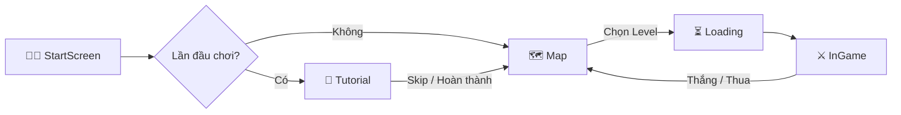

# 🏴‍☠️ Tổng Quan Dự Án — Pirate Tiles

> Tài liệu tổng quan dự án Pirate Tiles — Game giải đố Match-3 Tile trên mobile với chủ đề Cướp biển.

---

## 1. Giới Thiệu

**Pirate Tiles** là một tựa game giải đố 2D trên mobile, lấy cảm hứng từ thể loại **Match-3 Tile** (tương tự Tile Master, 3 Tiles). Người chơi chọn các **lá bài cướp biển** từ bàn cờ nhiều lớp (multi-layer board) để đưa vào **khay chứa (stack)**. Khi **3 lá bài cùng loại** xếp liền nhau trong khay, chúng sẽ được ghép (match) và biến mất. Mục tiêu là **dọn sạch toàn bộ bàn cờ** trong thời gian giới hạn.

### Theme — Cướp Biển 🏴‍☠️

Game mang chủ đề **Pirate (Cướp biển)** xuyên suốt:

| Yếu tố | Thể hiện |
|---|---|
| **Lá bài** | Các biểu tượng cướp biển: Kiếm, Mỏ neo, Sọ người, Kho báu, La bàn, Mắt kính, Rượu rum, Pháo, Cờ đen, Vẹt, Tàu, Bản đồ, Mũ captain |
| **Lá bài đặc biệt** | Các vật phẩm huyền thoại: Ngọc trai đen, Trái ác quỷ, Chìa khóa kho báu, Hòm vàng |
| **Background** | Biển cả, hòn đảo, tàu cướp biển |
| **UI/UX** | Phong cách bản đồ kho báu cổ, font chữ pirate, nút gỗ |
| **Âm thanh** | Nhạc nền phiêu lưu biển, SFX sóng biển, tiếng gươm, tiếng vàng |
| **Level Map** | Bản đồ hải tặc với các hòn đảo đại diện cho từng level |

---

## 2. Tính Năng Chính

| # | Tính năng | Mô tả | Độ ưu tiên |
|---|---|---|---|
| 1 | **Match-3 Tile** | Ghép 3 lá bài cùng loại trong khay chứa | 🔴 Core |
| 2 | **Multi-layer Board** | Bàn cờ nhiều tầng, lá bài phía trên che lá bài phía dưới | 🔴 Core |
| 3 | **Smart Insert** | Lá bài tự động chèn cạnh lá cùng loại trong stack | 🔴 Core |
| 4 | **Timer** | Đếm ngược thời gian mỗi màn chơi | 🔴 Core |
| 5 | **4 Power-ups** | Undo, Magic, Shuffle, Add One Cell | 🔴 Core |
| 6 | **Hearts System** | Hệ thống mạng sống, tự hồi phục theo thời gian (5 phút/heart) | 🔴 Core |
| 7 | **Coins System** | Đồng vàng (Gold Coins) — kiếm khi thắng, dùng mua power-up | 🟡 |
| 8 | **Star Rating** | Đánh giá 1–3 sao cho mỗi màn dựa trên thời gian | 🟡 |
| 9 | **Level Map** | Bản đồ hải tặc chọn màn chơi, hiển thị sao và trạng thái mở khóa | 🔴 Core |
| 10 | **Tutorial** | Hướng dẫn người chơi mới qua các bước tương tác | 🟡 |
| 11 | **Level Editor** | Công cụ thiết kế màn chơi trong Unity Editor | 🟡 |
| 12 | **Collectible Cards** | Lá bài đặc biệt (SCard) thu thập được — bộ sưu tập | 🟢 |
| 13 | **Revive** | Hồi sinh khi thua (xem quảng cáo) — undo 3 bài + reset timer | 🟢 |

---

## 3. Thông Số Kỹ Thuật

| Mục | Giá trị |
|---|---|
| **Engine** | Unity 6 (C#) |
| **Target Platform** | Android / iOS (Portrait) |
| **Architecture** | MVC (Model – View – Controller) |
| **Communication** | Event Channel (ScriptableObject-based) |
| **Animation** | DOTween |
| **UI** | TextMesh Pro + Canvas |
| **Data Persistence** | PlayerPrefs (qua SaveService abstraction) |
| **Resolution** | Portrait, 9:16 reference |

---

## 4. Cơ Chế Gameplay

### 4.1 Luật chơi cốt lõi

1. Bàn cờ gồm nhiều lá bài xếp chồng lên nhau theo nhiều tầng (layer)
2. Lá bài ở tầng trên che lá bài ở tầng dưới → lá bị che **không thể chọn**
3. Khi người chơi chọn 1 lá bài, lá đó di chuyển vào **khay chứa (stack)**
4. Khay chứa có tối đa **7 ô** (có thể mở rộng lên 8 bằng power-up)
5. Lá bài được **chèn thông minh**: tự động đặt cạnh lá cùng loại trong khay
6. Khi **3 lá cùng loại liền kề** trong khay → **match** → biến mất
7. **Thắng**: Dọn sạch hết bài trên bàn cờ
8. **Thua**: Khay chứa đầy (7/8 ô) HOẶC hết thời gian

### 4.2 Power-ups

| Power-up | Tên Pirate | Chức năng |
|---|---|---|
| **Undo** | ⚓ Quay lại | Hoàn tác lá bài cuối cùng — trả về bàn cờ |
| **Magic** | 🔮 Phép thuật | Tự động tìm lá bài trên bàn cờ để hoàn thành bộ 3 trong khay |
| **Shuffle** | 🌀 Xáo trộn | Xáo trộn vị trí tất cả lá bài trên bàn cờ + animation |
| **Add One Cell** | 📦 Mở rộng | Tăng kích thước khay chứa thêm 1 ô (max 8) |

### 4.3 Hệ thống Hearts

- Mặc định: **3 hearts**, tối đa 3
- Mất 1 heart mỗi lần thua
- Tự hồi phục: **1 heart / 5 phút**
- Hỗ trợ offline recovery (tính toán khi mở lại game)
- Khi hết hearts → không thể vào chơi

### 4.4 Hệ thống Coins

- Thắng mỗi màn: **+20 Gold Coins**
- Mua thêm lượt power-up: **100 Gold Coins**
- Lưu trữ persistent qua PlayerPrefs

---

## 5. Cấu Trúc Scene

| Scene | Vai trò |
|---|---|
| `StartScreen` | Màn hình bắt đầu game |
| `Tutorial` | Hướng dẫn cách chơi cho người mới |
| `Map` | Bản đồ hải tặc — chọn màn chơi, hiển thị sao |
| `Loading` | Màn hình chuyển cảnh, async load scene đích |
| `InGame` | Scene gameplay chính |

---

## 6. Tài Liệu Liên Quan

| File | Nội dung |
|---|---|
| `_02.Architecture.md` | Kiến trúc MVC chi tiết, thiết kế các layer |
| `_03.TaskBreakdown.md` | Phân rã công việc theo phase, bảng kế hoạch chi tiết |
| `_04.AdditionalNote.md` | Ghi chú kỹ thuật, best practices, lưu ý quan trọng |
| `ConventionRule.md` | Quy tắc đặt tên, coding convention, quy ước Unity |
| `DOCS_PROJECT_STRUCTURE.md` | Tài liệu cấu trúc thư mục và cách hoạt động dự án |

---

## 7. Điểm Khác Biệt So Với Bản Gốc (Wonder Match)

| Mục | Wonder Match (gốc) | Pirate Tiles (mới) |
|---|---|---|
| **Theme** | Hoa lá, bộ bài poker | 🏴‍☠️ Cướp biển, đảo kho báu |
| **Communication** | `EventBus` (static class) | **Event Channel** (ScriptableObject-based) |
| **Card Types** | cardA–cardK (13 loại bài poker) | 13 biểu tượng cướp biển |
| **Special Cards** | SCard_A–SCard_D | 4 vật phẩm huyền thoại hải tặc |
| **Card Database** | BICH, CO, RO, TEP (4 bộ bài) | Pirate theme sets |
| **Art Style** | Garden / Cozy | Pirate / Adventure |
| **Kiến trúc** | MVC + EventBus | MVC + **Event Channel SO** |
| **Gameplay** | Giữ nguyên 100% | Giữ nguyên 100% |

---

> **Ghi chú:** Pirate Tiles giữ nguyên **toàn bộ cơ chế gameplay** của Wonder Match. Sự khác biệt chính nằm ở **theme cướp biển** và việc chuyển từ **EventBus (static class)** sang **Event Channel (ScriptableObject-based)** để tăng tính linh hoạt, dễ debug trong Inspector, và giảm coupling.
