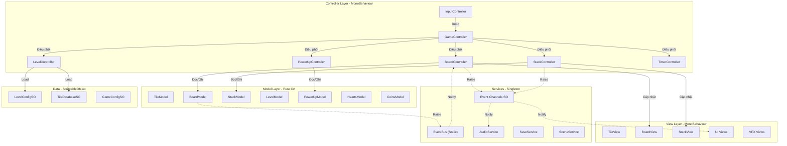
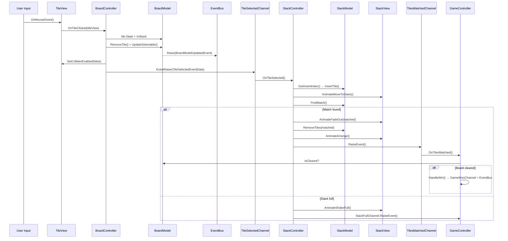

# 🏗️ Kiến Trúc MVC — Pirate Tiles

> Tài liệu thiết kế kiến trúc MVC cho dự án Pirate Tiles.  
> Mục tiêu: Xây dựng codebase theo mô hình **Model – View – Controller** rõ ràng, dễ bảo trì, dễ test.  
> Giao tiếp giữa các layer sử dụng **Hybrid: EventBus (static generic) + Event Channel SO (ScriptableObject-based)**.

---

## 1. Tổng Quan Kiến Trúc

### 1.1 Triết lý thiết kế

| Nguyên tắc | Áp dụng |
|---|---|
| **Separation of Concerns** | Model không biết View, View không chứa logic, Controller là cầu nối |
| **Single Responsibility** | Mỗi class chỉ làm một việc |
| **Event-Driven** | Các layer giao tiếp qua **EventBus** (nội bộ) và **Event Channel SO** (cross-layer) |
| **Dependency Injection (thủ công)** | Controller nhận Model/View qua constructor hoặc `[SerializeField]` |
| **Testability** | Model là pure C# class, có thể unit test không cần Unity |

### 1.2 Sơ đồ kiến trúc tổng thể



---

## 2. Hệ Thống Event — Hybrid Architecture

### 2.1 Tổng quan

Dự án sử dụng **2 hệ thống event** song song, mỗi hệ thống phục vụ mục đích riêng:

| | EventBus (Static Generic) | Event Channel SO (ScriptableObject) |
|---|---|---|
| **Mục đích** | Sự kiện nội bộ, system-level | Sự kiện cross-layer, designer-facing |
| **Coupling** | Type-based (thấp) | SO reference (rất thấp) |
| **Debug** | Code only | **Inspector visible** |
| **Config** | Hardcoded | **Inspector-configurable** |
| **Context** | Pure C# + MonoBehaviour | MonoBehaviour only |
| **Scene** | Global static | Per-scene hoặc shared |
| **Leak risk** | Cần clear thủ công | Dễ kiểm soát (OnDisable) |
| **Testing** | Mock qua interface | Tạo test SO |

### 2.2 Quy tắc chọn hệ thống

```
📌 CHỌN EventBus khi:
   ✅ Sự kiện nội bộ, tần suất cao (tile state changed)
   ✅ Sự kiện giữa các thành phần cùng layer (Model↔Model)
   ✅ Sự kiện system-level (game phase, scene load)
   ✅ Pure C# context (không có MonoBehaviour)
   ✅ Không cần debug trong Inspector

📌 CHỌN Event Channel SO khi:
   ✅ Sự kiện cross-layer (Controller↔View, Controller↔Controller)
   ✅ Cần debug/theo dõi trong Inspector
   ✅ Cần wire per-scene
   ✅ Designer cần hiểu/theo dõi
   ✅ Lifecycle gắn với MonoBehaviour (OnEnable/OnDisable)
```

### 2.3 Bảng phân bổ Event

#### EventBus Events (Static Generic)

| Event Struct | Payload | Publisher | Subscriber |
|---|---|---|---|
| `GamePhaseChangedEvent` | PreviousPhase, NewPhase | `GameController` | Nhiều thành phần |
| `TileStateChangedEvent` | TileId, PreviousState, NewState | `TileModel` | `BoardController` |
| `BoardModelUpdatedEvent` | RemainingTiles, SelectableTiles | `BoardModel` | `BoardController` |
| `SceneLoadRequestedEvent` | SceneName, UseLoadingScreen | `SceneService` | `SceneService` internal |
| `SaveDataChangedEvent` | Key | `SaveService` | Services |
| `AudioSettingChangedEvent` | IsMusicEnabled, IsSfxEnabled | `SettingController` | `AudioService` |

#### Event Channel SO (ScriptableObject-based)

| Event Channel SO | Kiểu dữ liệu | Publisher | Subscriber |
|---|---|---|---|
| `TileSelectedChannel` | `TileSelectedEventData` | `BoardController` | `StackController` |
| `TilesMatchedChannel` | `VoidEventChannelSO` | `StackController` | `GameController`, `AudioController` |
| `GameWonChannel` | `VoidEventChannelSO` | `GameController` | `WinPanelView`, `AudioController` |
| `GameLostChannel` | `VoidEventChannelSO` | `GameController` | `LosePanelView`, `AudioController` |
| `GamePausedChannel` | `BoolEventChannelSO` | `GameController` | `TimerController`, `AudioController` |
| `TimerExpiredChannel` | `VoidEventChannelSO` | `TimerController` | `GameController` |
| `StackFullChannel` | `VoidEventChannelSO` | `StackController` | `GameController` |
| `BoardClearedChannel` | `VoidEventChannelSO` | `BoardController` | `GameController` |
| `PowerUpUsedChannel` | `PowerUpUsedEventData` | `PowerUpController` | `AudioController` |
| `CoinsChangedChannel` | `IntEventChannelSO` | `CoinsController` | `CoinsView` |
| `HeartsChangedChannel` | `IntEventChannelSO` | `HeartsController` | `HeartsView` |
| `LevelStartedChannel` | `IntEventChannelSO` | `LevelController` | `AudioController` |
| `UndoRequestChannel` | `VoidEventChannelSO` | `PowerUpController` | `BoardController`, `StackController` |
| `ShuffleCompletedChannel` | `VoidEventChannelSO` | `BoardController` | `TimerController` |
| `SpendCoinsRequestChannel` | `EventChannelSO<PowerType>` | `PowerUpController` | `CoinsController` |
| `OutOfHeartsChannel` | `VoidEventChannelSO` | `HeartsController` | `OutOfHeartPanelView` |

### 2.4 EventBus — Cấu trúc & Cách dùng

```csharp
// === Event struct (payload dùng struct) ===
public struct GamePhaseChangedEvent : IEvent {
    public GamePhase PreviousPhase;
    public GamePhase NewPhase;
}

// === Publisher ===
EventBus<GamePhaseChangedEvent>.Raise(new GamePhaseChangedEvent {
    PreviousPhase = GamePhase.Init,
    NewPhase = GamePhase.Playing
});

// === Subscriber ===
private EventBinding<GamePhaseChangedEvent> _phaseBinding;

void OnEnable() {
    _phaseBinding = new EventBinding<GamePhaseChangedEvent>(OnPhaseChanged);
    EventBus<GamePhaseChangedEvent>.Register(_phaseBinding);
}

void OnDisable() {
    EventBus<GamePhaseChangedEvent>.Deregister(_phaseBinding);
}

void OnPhaseChanged(GamePhaseChangedEvent e) {
    // Handle phase change
}
```

### 2.5 Event Channel SO — Cấu trúc & Cách dùng

```csharp
// === Base Event Channel (không tham số) ===
[CreateAssetMenu(menuName = "PirateTiles/Events/Void Event Channel")]
public class VoidEventChannelSO : ScriptableObject {
    private Action _onEventRaised;

    public void RaiseEvent() {
        _onEventRaised?.Invoke();
    }

    public void Subscribe(Action listener) {
        _onEventRaised += listener;
    }

    public void Unsubscribe(Action listener) {
        _onEventRaised -= listener;
    }
}

// === Generic Event Channel (1 tham số — struct payload) ===
public abstract class EventChannelSO<T> : ScriptableObject {
    // Dùng EventListener<T> pattern
    // Subscribe qua Inspector hoặc code
}

// === Event Data Structs ===
public struct TileSelectedEventData {
    public int TileId;
    public CardType TileType;
    public int GridX;
    public int GridY;
    public int LayerIndex;
}

public struct PowerUpUsedEventData {
    public PowerType Type;
    public int RemainingCount;
}
```

```csharp
// === Controller dùng Event Channel SO ===
public class BoardController : MonoBehaviour {
    [Header("Event Channels")]
    [SerializeField] private TileSelectedChannelSO _tileSelectedChannel;
    [SerializeField] private VoidEventChannelSO _boardClearedChannel;

    private void HandleNormalTile(int tileId, CardType type) {
        _tileSelectedChannel.EventRaise(new TileSelectedEventData {
            TileId = tileId,
            TileType = type
        });
    }
}

// === Subscriber ===
public class StackController : MonoBehaviour {
    [SerializeField] private VoidEventChannelSO _tilesMatchedChannel;

    private void OnEnable() {
        _tilesMatchedChannel.Subscribe(OnTilesMatched);
    }

    private void OnDisable() {
        _tilesMatchedChannel.Unsubscribe(OnTilesMatched);
    }

    private void OnTilesMatched() { /* Handle */ }
}
```

---

## 3. Các Layer Chi Tiết

### 3.1 Model Layer — Dữ liệu & Logic thuần

> **Quy tắc:**  
> - ❌ KHÔNG kế thừa `MonoBehaviour`  
> - ❌ KHÔNG reference `UnityEngine` (trừ `Vector3`, `Mathf` khi cần)  
> - ✅ Pure C# class  
> - ✅ Có thể unit test độc lập  
> - ✅ Chứa toàn bộ business logic  
> - ✅ Có thể Raise EventBus events (system-level notifications)

#### Danh sách Model

| Model | Trách nhiệm | Dữ liệu chính |
|---|---|---|
| `TileModel` | Dữ liệu 1 lá bài | `TileType`, `TileState`, `GridPosition`, `LayerIndex`, `IsSelectable` |
| `BoardModel` | Trạng thái toàn bộ bàn cờ | `List<TileModel>`, logic overlap, logic check win |
| `StackModel` | Trạng thái khay chứa | `List<TileModel>`, logic match-3, logic insert, check full |
| `LevelModel` | Dữ liệu level hiện tại | `LevelIndex`, `TimeLimit`, `MaxStackSize` |
| `PowerUpModel` | Trạng thái power-up | `Dictionary<PowerType, int>` counts |
| `HeartsModel` | Hệ thống mạng sống | `CurrentHearts`, `MaxHearts`, `HealTime`, `LastHealTimestamp` |
| `CoinsModel` | Hệ thống tiền tệ | `CurrentCoins`, `PowerCost` |
| `TileHistoryModel` | Lịch sử chọn bài | `Stack<TileMoveRecord>` |
| `GameStateModel` | Trạng thái game | `IsPaused`, `IsProcessing`, `GamePhase` enum |

#### Chi tiết thiết kế Model

```csharp
public class TileModel {
    public int Id { get; }
    public CardType TileType { get; set; }
    public CardState State { get; set; }
    public Vector2Int GridPosition { get; }
    public int LayerIndex { get; }
    public bool IsSelectable { get; set; }
    public bool IsSpecialTile => TileType >= CardType.Special1;
}

public class BoardModel {
    private List<TileModel> _tiles;
    private Dictionary<int, List<int>> _overlapMap;

    public IReadOnlyList<TileModel> Tiles => _tiles.AsReadOnly();
    public int RemainingTiles => _tiles.Count(t => t.State == CardState.InBoard);

    public void RemoveTile(int tileId) { ... }
    public void UpdateSelectableStatus() {
        // ... logic ...
        // Raise EventBus event (nội bộ Model)
        EventBus<BoardModelUpdatedEvent>.Raise(new BoardModelUpdatedEvent {
            RemainingTiles = RemainingTiles,
            SelectableTiles = _tiles.Count(t => t.IsSelectable)
        });
    }
    public bool IsCleared => RemainingTiles <= 0;
}

public class StackModel {
    private List<TileModel> _tiles;
    public int MaxSize { get; set; }
    public IReadOnlyList<TileModel> Tiles => _tiles.AsReadOnly();
    public int Count => _tiles.Count;
    public bool IsFull => Count >= MaxSize;

    public int GetInsertIndex(CardType type) { ... }
    public void InsertTile(int index, TileModel tile) { ... }
    public int FindMatch() { ... }
}

public enum GamePhase {
    None, Init, ShuffleIntro, Playing, Paused, Won, Lost
}

public class GameStateModel {
    public GamePhase Phase { get; set; }
    public bool IsProcessingTile { get; set; }
    public bool IsUsingPower { get; set; }
    public bool IsAnimating { get; set; }

    public bool CanInteract =>
        Phase == GamePhase.Playing
        && !IsProcessingTile
        && !IsUsingPower
        && !IsAnimating;
}
```

---

### 3.2 View Layer — Hiển thị & Animation

> **Quy tắc:**  
> - ✅ Kế thừa `MonoBehaviour`  
> - ✅ Xử lý rendering, animation, VFX, UI display  
> - ❌ KHÔNG chứa business logic  
> - ❌ KHÔNG trực tiếp thay đổi Model  
> - ✅ Expose public methods để Controller gọi  
> - ✅ Subscribe Event Channel SO trong Inspector (cross-layer)

#### Danh sách View

| View | Trách nhiệm |
|---|---|
| `TileView` | Render sprite, VFX dim/brighten, animation di chuyển, dissolve effect |
| `BoardView` | Quản lý tất cả `TileView`, spawn/despawn, cập nhật visual |
| `StackView` | Render stack UI, animation add/remove/arrange |
| `TimerView` | Hiển thị countdown timer |
| `WinPanelView` | Animation + UI khi thắng |
| `LosePanelView` | Animation + UI khi thua |
| `SettingPanelView` | UI Settings (Music, SFX, Resume, Replay) |
| `HeartsView` | Hiển thị hearts + countdown heal |
| `CoinsView` | Hiển thị số coins |
| `PowerUpBarView` | Hiển thị 4 nút power-up + số lượt |
| `MapView` | Render level map, stars, lock/unlock buttons |
| `TutorialView` | Hiển thị hướng dẫn từng bước |
| `LoadingView` | Loading screen + progress bar |

---

### 3.3 Controller Layer — Điều phối & Logic flow

> **Quy tắc:**  
> - ✅ Kế thừa `MonoBehaviour`  
> - ✅ Xử lý input → cập nhật Model → cập nhật View  
> - ✅ Raise/Subscribe **Event Channel SO** (cross-layer events)  
> - ✅ Register/Deregister **EventBus** (system-level events)  
> - ❌ KHÔNG render, animation  
> - ❌ KHÔNG chứa dữ liệu state

#### Chi tiết Controller chính

```csharp
public class GameController : MonoBehaviour {
    [Header("Controllers")]
    [SerializeField] private BoardController _boardController;
    [SerializeField] private StackController _stackController;

    [Header("Event Channels (Cross-Layer)")]
    [SerializeField] private VoidEventChannelSO _tilesMatchedChannel;
    [SerializeField] private VoidEventChannelSO _stackFullChannel;
    [SerializeField] private VoidEventChannelSO _timerExpiredChannel;
    [SerializeField] private VoidEventChannelSO _gameWonChannel;
    [SerializeField] private VoidEventChannelSO _gameLostChannel;

    // EventBus binding (System-Level)
    private EventBinding<GamePhaseChangedEvent> _phaseBinding;
    private GameStateModel _gameState;

    private void OnEnable() {
        // Event Channel SO — cross-layer
        _tilesMatchedChannel.Subscribe(OnTilesMatched);
        _stackFullChannel.Subscribe(OnStackFull);
        _timerExpiredChannel.Subscribe(OnTimerExpired);
    }

    private void OnDisable() {
        _tilesMatchedChannel.Unsubscribe(OnTilesMatched);
        _stackFullChannel.Unsubscribe(OnStackFull);
        _timerExpiredChannel.Unsubscribe(OnTimerExpired);
    }

    private void HandleWin() {
        var prevPhase = _gameState.Phase;
        _gameState.Phase = GamePhase.Won;
        // EventBus — system-level notification
        EventBus<GamePhaseChangedEvent>.Raise(new GamePhaseChangedEvent {
            PreviousPhase = prevPhase,
            NewPhase = GamePhase.Won
        });
        // Event Channel SO — cross-layer notification
        _gameWonChannel.RaiseEvent();
    }
}
```

---

### 3.4 Services Layer

> Singleton (DontDestroyOnLoad), không phụ thuộc vào Controller/View cụ thể.

| Service | Trách nhiệm |
|---|---|
| `AudioService` | Quản lý BGM, SFX qua AudioMixer |
| `SaveService` | Wrapper PlayerPrefs + domain-specific methods |
| `SceneService` | Chuyển scene async với loading screen |

---

### 3.5 Data Layer — ScriptableObject

| ScriptableObject | Nội dung |
|---|---|
| `TileDatabaseSO` | Mảng `TileData` (TileType + Sprite) cho mỗi bộ bài |
| `LevelConfigSO` | Cấu hình: time limit, stack size, tile layout |
| `GameConfigSO` | Cấu hình chung: max hearts, heal time, power cost |
| `AudioConfigSO` | Mapping SoundEffect enum → AudioClip |

---

## 4. Luồng Dữ Liệu (Data Flow)

### 4.1 Click lá bài → Match



### 4.2 Quy tắc Data Flow

```
📌 QUY TẮC VÀNG:

   User Input → Controller → Model (update data)
                           → View (update display)
                           → Event Channel SO (notify cross-layer)
                           → EventBus (notify system-level)

   ❌ View KHÔNG BAO GIỜ gọi Model
   ❌ Model KHÔNG BAO GIỜ gọi View
   ❌ Controller A KHÔNG gọi trực tiếp Controller B
      → Dùng Event Channel SO để giao tiếp cross-layer
   ✅ Model CÓ THỂ Raise EventBus (nội bộ, system-level)
```

---

## 5. Cấu Trúc Thư Mục MVC

```
Assets/
├── _PirateTiles/
│   ├── Scripts/
│   │   ├── Models/
│   │   ├── Views/
│   │   ├── Controllers/
│   │   ├── Services/
│   │   ├── Data/
│   │   │   ├── Enums/
│   │   │   ├── Constants/
│   │   │   ├── EventBus/          # ⚡ EventBus infrastructure
│   │   │   │   ├── EventBus.cs
│   │   │   │   ├── EventBinding.cs
│   │   │   │   ├── IEvent.cs
│   │   │   │   ├── EventBusUtil.cs
│   │   │   │   ├── PredefinedAssemblyUtil.cs
│   │   │   │   └── Events/        # Event struct definitions
│   │   │   │       ├── GameEvents.cs
│   │   │   │       ├── TileEvents.cs
│   │   │   │       └── AudioEvents.cs
│   │   │   ├── EventChannels/     # 📡 Event Channel SO
│   │   │   │   ├── EventChannelSO.cs
│   │   │   │   ├── EventListener.cs
│   │   │   │   ├── VoidEventChannelSO.cs
│   │   │   │   ├── BoolEventChannelSO.cs
│   │   │   │   ├── IntEventChannelSO.cs
│   │   │   │   └── TileSelectedChannelSO.cs
│   │   │   ├── EventData/         # Struct payloads
│   │   │   │   ├── TileSelectedEventData.cs
│   │   │   │   └── PowerUpUsedEventData.cs
│   │   │   └── ScriptableObjects/
│   │   ├── Utils/
│   │   └── Editor/
│   ├── Scenes/
│   ├── Prefabs/
│   ├── Resources/
│   │   ├── EventChannels/    # Event Channel SO assets
│   │   └── ...
```

---

## 6. Scene & Prefab Setup

### Prefab: `GameManager` (DontDestroyOnLoad)

```
GameManager (GameObject)
├── AudioService
├── SaveService
├── SceneService
└── (Event Channel SO là assets, không cần MonoBehaviour)
└── (EventBus là static class, không cần GameObject)
```

### Scene: `InGame` — Hierarchy

```
InGame (Scene)
├── GameController
│   ├── BoardController → BoardView → [TileView instances]
│   ├── StackController → StackView → SlotPositions
│   ├── PowerUpController → PowerUpBarView
│   ├── TimerController → TimerView
│   ├── HeartsController → HeartsView
│   └── CoinsController → CoinsView
├── Canvas
│   ├── WinPanelView
│   ├── LosePanelView
│   └── SettingPanelView
├── Camera
└── Background
```

---

> **Ghi chú:** Kiến trúc này dùng **hệ thống hybrid**: EventBus (static generic) cho sự kiện nội bộ/system-level + Event Channel SO cho sự kiện cross-layer cần debug Inspector. Mỗi event payload dùng **struct**.
