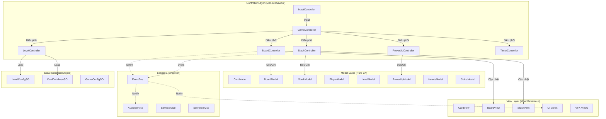
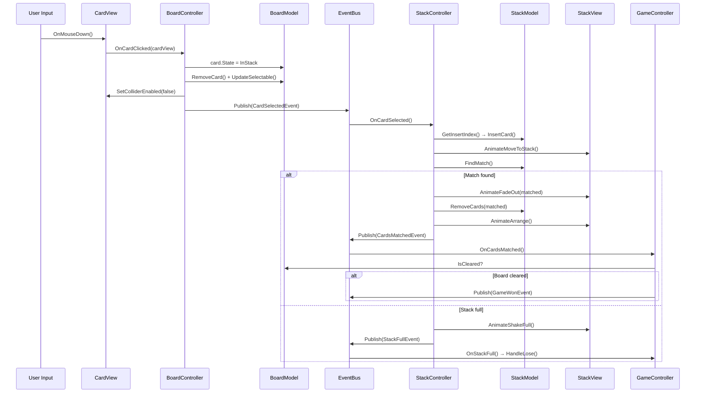

# 🏗️ Kiến Trúc MVC — Wonder Match (Rebuild)

> Tài liệu thiết kế kiến trúc MVC cho dự án Wonder Match.  
> Mục tiêu: Tái cấu trúc toàn bộ codebase theo mô hình **Model – View – Controller** rõ ràng, dễ bảo trì, dễ test.

---

## 1. Tổng Quan Kiến Trúc

### 1.1 Triết lý thiết kế

| Nguyên tắc | Áp dụng |
|---|---|
| **Separation of Concerns** | Model không biết View, View không chứa logic, Controller là cầu nối |
| **Single Responsibility** | Mỗi class chỉ làm một việc |
| **Event-Driven** | Các layer giao tiếp qua EventBus, không reference trực tiếp |
| **Dependency Injection (thủ công)** | Controller nhận Model/View qua constructor hoặc `[SerializeField]` |
| **Testability** | Model là pure C# class, có thể unit test không cần Unity |

### 1.2 Sơ đồ kiến trúc tổng thể



---

## 2. Các Layer Chi Tiết

### 2.1 Model Layer — Dữ liệu & Logic thuần

> **Quy tắc:**  
> - ❌ KHÔNG kế thừa `MonoBehaviour`  
> - ❌ KHÔNG reference `UnityEngine` (trừ `Vector3`, `Mathf` khi cần)  
> - ❌ KHÔNG chứa logic hiển thị, animation, UI  
> - ✅ Pure C# class  
> - ✅ Có thể unit test độc lập  
> - ✅ Chứa toàn bộ business logic

#### Danh sách Model

| Model | Trách nhiệm | Dữ liệu chính |
|---|---|---|
| `CardModel` | Dữ liệu 1 lá bài | `CardType`, `CardState`, `GridPosition`, `LayerIndex`, `IsSelectable` |
| `BoardModel` | Trạng thái toàn bộ bàn cờ | `List<CardModel>`, logic overlap, logic check win |
| `StackModel` | Trạng thái khay chứa | `List<CardModel>`, logic match-3, logic insert, check full |
| `PlayerModel` | Dữ liệu player | `PlayerID`, `Score`, `StackModel` ref |
| `LevelModel` | Dữ liệu level hiện tại | `LevelIndex`, `TimeLimit`, `MaxStackSize` |
| `PowerUpModel` | Trạng thái power-up | `Dictionary<PowerType, int>` counts |
| `HeartsModel` | Hệ thống mạng sống | `CurrentHearts`, `MaxHearts`, `HealTime`, `LastHealTimestamp` |
| `CoinsModel` | Hệ thống tiền tệ | `CurrentCoins`, `PowerCost` |
| `CardHistoryModel` | Lịch sử chọn bài | `Stack<CardMoveRecord>` |
| `GameStateModel` | Trạng thái game | `IsPaused`, `IsProcessing`, `GamePhase` enum |

#### Chi tiết thiết kế Model

```csharp
// ==================== CardModel ====================
public class CardModel {
    public int Id { get; }                    // Unique ID
    public CardType CardType { get; set; }    // Loại bài
    public CardState State { get; set; }      // inBoard / inStack
    public Vector2Int GridPosition { get; }   // Vị trí trên grid
    public int LayerIndex { get; }            // Tầng (layer)
    public bool IsSelectable { get; set; }    // Có thể chọn?
    public bool IsSpecialCard => CardType >= CardType.SCard_A;
}

// ==================== BoardModel ====================
public class BoardModel {
    private List<CardModel> _cards;
    private Dictionary<int, List<int>> _overlapMap; // cardId → list of ids bị che

    public IReadOnlyList<CardModel> Cards => _cards.AsReadOnly();
    public int RemainingCards => _cards.Count(c => c.State == CardState.InBoard);

    public void RemoveCard(int cardId) { ... }
    public List<int> GetCardsAbove(int cardId) { ... }
    public List<int> GetCardsBelow(int cardId) { ... }
    public void UpdateSelectableStatus() { ... }  // Cập nhật IsSelectable cho tất cả
    public bool IsCleared => RemainingCards <= 0;
    public List<CardModel> GetCardsByType(CardType type) { ... }
    public void ShuffleCardTypes() { ... }        // Shuffle logic (Fisher-Yates)
}

// ==================== StackModel ====================
public class StackModel {
    private List<CardModel> _cards;
    public int MaxSize { get; set; }              // Mặc định 7, max 8

    public IReadOnlyList<CardModel> Cards => _cards.AsReadOnly();
    public int Count => _cards.Count;
    public bool IsFull => Count >= MaxSize;

    public int GetInsertIndex(CardType type) { ... }  // Smart insert
    public void InsertCard(int index, CardModel card) { ... }
    public void RemoveCard(CardModel card) { ... }

    // Trả về index nếu match, -1 nếu không
    public int FindMatch() { ... }
    public List<CardModel> GetMatchedCards(int matchIndex) { ... }

    // Power-up support
    public (CardType type, int count) GetMostFrequentType() { ... }
    public void ExpandSize() { MaxSize++; }
}

// ==================== HeartsModel ====================
public class HeartsModel {
    public int Current { get; private set; }
    public int Max { get; }
    public float HealTimeSeconds { get; }           // 300s
    public DateTime LastHealTimestamp { get; private set; }

    public bool HasHearts => Current > 0;
    public bool IsFull => Current >= Max;
    public float TimeUntilNextHeal { get; }

    public void LoseHeart() { ... }
    public void HealHeart(int amount) { ... }
    public void RecoverOfflineHearts() { ... }      // Tính heal khi offline
}

// ==================== GameStateModel ====================
public enum GamePhase {
    Initializing,   // Đang load level
    ShuffleIntro,   // Animation shuffle đầu game
    Playing,        // Đang chơi
    Paused,         // Tạm dừng
    Won,            // Đã thắng
    Lost             // Đã thua
}

public class GameStateModel {
    public GamePhase Phase { get; set; }
    public bool IsProcessingCard { get; set; }
    public bool IsUsingPower { get; set; }
    public bool IsAnimating { get; set; }

    public bool CanInteract =>
        Phase == GamePhase.Playing
        && !IsProcessingCard
        && !IsUsingPower
        && !IsAnimating;
}
```

---

### 2.2 View Layer — Hiển thị & Animation

> **Quy tắc:**  
> - ✅ Kế thừa `MonoBehaviour`  
> - ✅ Xử lý rendering, animation, VFX, UI display  
> - ❌ KHÔNG chứa business logic  
> - ❌ KHÔNG trực tiếp thay đổi Model  
> - ✅ Expose public methods để Controller gọi  
> - ✅ Raise events UI (button click) để Controller xử lý

#### Danh sách View

| View | Trách nhiệm |
|---|---|
| `CardView` | Render sprite, VFX dim/brighten, animation di chuyển, dissolve effect |
| `BoardView` | Quản lý tất cả `CardView`, spawn/despawn, cập nhật visual |
| `StackView` | Render stack UI, animation add/remove/arrange |
| `TimerView` | Hiển thị countdown timer |
| `WinPanelView` | Animation + UI khi thắng |
| `LosePanelView` | Animation + UI khi thua |
| `SettingPanelView` | UI Settings (Music, SFX, Resume, Replay) |
| `HeartsView` | Hiển thị hearts + countdown heal |
| `CoinsView` | Hiển thị số coins |
| `PowerUpBarView` | Hiển thị 4 nút power-up + số lượt |
| `MapView` | Render level map, stars, lock/unlock buttons |
| `TutorialView` | Hiển thị hướng dẫn từng bước |
| `LoadingView` | Loading screen + progress bar |

#### Chi tiết thiết kế View

```csharp
// ==================== CardView ====================
public class CardView : MonoBehaviour {
    [SerializeField] private SpriteRenderer _spriteRenderer;
    [SerializeField] private BoxCollider _collider;

    private MaterialPropertyBlock _propertyBlock;

    // === Được gọi bởi Controller ===
    public void SetSprite(Sprite sprite) { ... }
    public void SetSelectable(bool selectable) { ... }   // Dim/Brighten
    public void SetColliderEnabled(bool enabled) { ... }

    // === Animation (trả về Tween để Controller chain) ===
    public Tween AnimateMoveToStack(Vector3 target, float duration) { ... }
    public Tween AnimateMoveToPosition(Vector3 target, float duration) { ... }
    public Tween AnimateUndoMove(Vector3 target) { ... }
    public Tween AnimateFadeOut(float duration) { ... }
    public Tween AnimateCollect() { ... }  // Special card animation

    // === Input (raise event) ===
    private void OnMouseDown() {
        OnCardClicked?.Invoke(this);
    }
    public event Action<CardView> OnCardClicked;
}

// ==================== StackView ====================
public class StackView : MonoBehaviour {
    [SerializeField] private Transform[] _slotPositions;

    public Vector3 GetSlotPosition(int index) => _slotPositions[index].position;
    public Tween AnimateArrange(List<CardView> cards) { ... }
    public Tween AnimateShakeFull() { ... }
}

// ==================== PowerUpBarView ====================
public class PowerUpBarView : MonoBehaviour {
    [SerializeField] private TextMeshProUGUI _undoCountText;
    [SerializeField] private TextMeshProUGUI _magicCountText;
    [SerializeField] private TextMeshProUGUI _shuffleCountText;
    [SerializeField] private TextMeshProUGUI _addCellCountText;

    public void UpdateCounts(int undo, int magic, int shuffle, int addCell) { ... }

    // Button events
    public event Action OnUndoClicked;
    public event Action OnMagicClicked;
    public event Action OnShuffleClicked;
    public event Action OnAddCellClicked;
}
```

---

### 2.3 Controller Layer — Điều phối & Logic flow

> **Quy tắc:**  
> - ✅ Kế thừa `MonoBehaviour` (cần lifecycle Unity)  
> - ✅ Là **cầu nối** giữa Model và View  
> - ✅ Xử lý input → cập nhật Model → cập nhật View  
> - ✅ Publish/Subscribe events qua EventBus  
> - ❌ KHÔNG render, animation (delegate cho View)  
> - ❌ KHÔNG chứa dữ liệu state (delegate cho Model)

#### Danh sách Controller

| Controller | Trách nhiệm |
|---|---|
| `GameController` | **Điều phối trung tâm** — quản lý game flow, phase transitions |
| `BoardController` | Xử lý logic board: click bài, overlap check, shuffle, check win |
| `StackController` | Xử lý logic stack: nhận bài, match, remove, arrange |
| `PowerUpController` | Xử lý 4 power-ups, kết nối với Board/Stack |
| `TimerController` | Điều khiển countdown, trigger lose |
| `LevelController` | Load/unload level, unlock progress |
| `HeartsController` | Quản lý hearts logic + heal timer |
| `CoinsController` | Quản lý coins, mua power-up |
| `TutorialController` | Điều khiển flow tutorial |
| `AudioController` | Phát âm thanh dựa trên game events |

#### Chi tiết Controller chính

```csharp
// ==================== GameController ====================
public class GameController : MonoBehaviour {
    // --- Dependencies (inject via SerializeField hoặc Find) ---
    [SerializeField] private BoardController _boardController;
    [SerializeField] private StackController _stackController;
    [SerializeField] private PowerUpController _powerUpController;
    [SerializeField] private TimerController _timerController;

    // --- Models ---
    private GameStateModel _gameState;
    private LevelModel _levelModel;

    private void Start() {
        _gameState = new GameStateModel();
        InitializeLevel();
    }

    private async void InitializeLevel() {
        _gameState.Phase = GamePhase.Initializing;

        // 1. Load level data
        _levelModel = _levelController.LoadLevel(LevelManager.CurrLevel);

        // 2. Init board
        _boardController.Initialize(_levelModel);

        // 3. Shuffle intro
        _gameState.Phase = GamePhase.ShuffleIntro;
        await _boardController.PlayShuffleIntro();

        // 4. Start playing
        _gameState.Phase = GamePhase.Playing;
        _timerController.StartTimer(_levelModel.TimeLimit);
    }

    // --- Event handlers ---
    private void OnCardMatched() {
        if (_boardController.IsCleared()) {
            HandleWin();
        }
    }

    private void OnStackFull() {
        HandleLose();
    }

    private void OnTimerExpired() {
        HandleLose();
    }

    private void HandleWin() {
        _gameState.Phase = GamePhase.Won;
        _timerController.StopTimer();
        _levelController.UnlockNextLevel();
        EventBus.Publish(new GameWonEvent());
    }

    private void HandleLose() {
        _gameState.Phase = GamePhase.Lost;
        _timerController.StopTimer();
        EventBus.Publish(new GameLostEvent());
    }

    // --- Public API ---
    public void PauseGame() { ... }
    public void ResumeGame() { ... }
    public void RestartLevel() { ... }
    public void ExitToMap() { ... }
}

// ==================== BoardController ====================
public class BoardController : MonoBehaviour {
    [SerializeField] private BoardView _boardView;
    private BoardModel _boardModel;
    private GameStateModel _gameState; // injected

    public void Initialize(LevelModel level) {
        _boardModel = new BoardModel(level.Cards);
        _boardView.SpawnCards(_boardModel.Cards);
        _boardModel.UpdateSelectableStatus();
        SyncViewWithModel();
    }

    public void OnCardClicked(CardView cardView) {
        if (!_gameState.CanInteract) return;

        CardModel cardModel = GetModelForView(cardView);
        if (!cardModel.IsSelectable) return;

        if (cardModel.IsSpecialCard) {
            HandleSpecialCard(cardModel, cardView);
        } else {
            HandleNormalCard(cardModel, cardView);
        }
    }

    private void HandleNormalCard(CardModel model, CardView view) {
        _gameState.IsProcessingCard = true;

        // 1. Update model
        model.State = CardState.InStack;
        _boardModel.RemoveCard(model.Id);
        _boardModel.UpdateSelectableStatus();

        // 2. Update view
        view.SetColliderEnabled(false);
        SyncViewWithModel();

        // 3. Notify stack
        EventBus.Publish(new CardSelectedEvent(model, view));

        // 4. Record history
        _historyModel.Push(new CardMoveRecord(model, view.transform.position));
    }

    // ... Shuffle, UpdateOverlap, CheckWin ...
}

// ==================== StackController ====================
public class StackController : MonoBehaviour {
    [SerializeField] private StackView _stackView;
    private StackModel _stackModel;

    private void OnEnable() {
        EventBus.Subscribe<CardSelectedEvent>(OnCardSelected);
    }

    private async void OnCardSelected(CardSelectedEvent evt) {
        CardModel card = evt.Card;
        CardView cardView = evt.CardView;

        // 1. Tính toán vị trí insert
        int insertIndex = _stackModel.GetInsertIndex(card.CardType);
        _stackModel.InsertCard(insertIndex, card);

        // 2. Animation
        Vector3 targetPos = _stackView.GetSlotPosition(insertIndex);
        await cardView.AnimateMoveToStack(targetPos, 0.5f).AsyncWaitForCompletion();
        await _stackView.AnimateArrange(GetCardViews());

        // 3. Check match
        int matchIndex = _stackModel.FindMatch();
        if (matchIndex >= 0) {
            await HandleMatch(matchIndex);
        } else if (_stackModel.IsFull) {
            await HandleStackFull();
        }

        _gameState.IsProcessingCard = false;
    }

    private async Task HandleMatch(int matchIndex) {
        var matched = _stackModel.GetMatchedCards(matchIndex);
        // Fade out animation
        // Remove from model
        // Rearrange
        // Publish event
        EventBus.Publish(new CardsMatchedEvent());
    }
}
```

---

### 2.4 Services Layer — Dịch vụ chia sẻ

> **Quy tắc:**  
> - ✅ Singleton (hoặc ServiceLocator pattern)  
> - ✅ DontDestroyOnLoad  
> - ✅ Không phụ thuộc vào bất kỳ Controller/View cụ thể nào

#### `EventBus` — Hệ thống sự kiện

```csharp
public static class EventBus {
    private static Dictionary<Type, List<Delegate>> _subscribers = new();

    public static void Subscribe<T>(Action<T> handler) where T : IGameEvent { ... }
    public static void Unsubscribe<T>(Action<T> handler) where T : IGameEvent { ... }
    public static void Publish<T>(T gameEvent) where T : IGameEvent { ... }
    public static void Clear() { ... }
}

// === Event Definitions ===
public interface IGameEvent { }

public record CardSelectedEvent(CardModel Card, CardView CardView) : IGameEvent;
public record CardsMatchedEvent() : IGameEvent;
public record GameWonEvent() : IGameEvent;
public record GameLostEvent() : IGameEvent;
public record GamePausedEvent(bool IsPaused) : IGameEvent;
public record TimerExpiredEvent() : IGameEvent;
public record PowerUpUsedEvent(PowerType Type) : IGameEvent;
public record CoinsChangedEvent(int NewAmount) : IGameEvent;
public record HeartsChangedEvent(int NewAmount) : IGameEvent;
public record StackFullEvent() : IGameEvent;
public record BoardClearedEvent() : IGameEvent;
public record LevelStartedEvent(int LevelIndex) : IGameEvent;
public record ShuffleCompletedEvent() : IGameEvent;
```

#### `SaveService` — Lưu trữ dữ liệu

```csharp
public class SaveService : MonoBehaviour {
    public static SaveService Instance { get; private set; }

    // Generic save/load thay vì trực tiếp PlayerPrefs rải rác
    public void SaveInt(string key, int value) { ... }
    public int LoadInt(string key, int defaultValue = 0) { ... }
    public void SaveString(string key, string value) { ... }
    public string LoadString(string key, string defaultValue = "") { ... }
    public void SaveFloat(string key, float value) { ... }

    // Domain-specific
    public void SaveGameProgress(GameProgressData data) { ... }
    public GameProgressData LoadGameProgress() { ... }
    public void ClearAll() { ... }
}
```

#### `AudioService` — Quản lý âm thanh

```csharp
public class AudioService : MonoBehaviour {
    public static AudioService Instance { get; private set; }

    public void PlaySFX(SoundEffect effect) { ... }
    public void PlayBGM() { ... }
    public void StopBGM() { ... }
    public void PauseAll() { ... }
    public void ResumeAll() { ... }
    public void SetMusicEnabled(bool enabled) { ... }
    public void SetSFXEnabled(bool enabled) { ... }
}
```

#### `SceneService` — Chuyển scene

```csharp
public class SceneService : MonoBehaviour {
    public static SceneService Instance { get; private set; }

    public void LoadScene(string sceneName) { ... }  // Với loading screen
    public void LoadSceneImmediate(string sceneName) { ... }
}
```

---

### 2.5 Data Layer — ScriptableObject

> Cấu hình tĩnh, được tạo sẵn trong Unity Editor.

| ScriptableObject | Nội dung |
|---|---|
| `CardDatabaseSO` | Mảng `CardData` (CardType + Sprite) cho mỗi bộ bài |
| `LevelConfigSO` | Cấu hình cho từng level: time limit, stack size, card layout |
| `GameConfigSO` | Cấu hình chung: max hearts, heal time, power cost, initial counts |
| `AudioConfigSO` | Mapping SoundEffect enum → AudioClip + mixer group |

```csharp
[CreateAssetMenu(menuName = "WonderMatch/Level Config")]
public class LevelConfigSO : ScriptableObject {
    public int levelIndex;
    public float timeLimit = 60f;
    public int maxStackSize = 7;
    public GameObject levelPrefab; // Hoặc dữ liệu layout
}

[CreateAssetMenu(menuName = "WonderMatch/Game Config")]
public class GameConfigSO : ScriptableObject {
    [Header("Hearts")]
    public int maxHearts = 3;
    public float healTimeSeconds = 300f;

    [Header("Coins")]
    public int powerUpCost = 100;
    public int coinsPerWin = 20;

    [Header("Power-ups")]
    public int initialPowerCount = 3;

    [Header("Stack")]
    public int defaultStackSize = 7;
    public int maxStackSize = 8;
}
```

---

## 3. Cấu Trúc Thư Mục MVC

```
Assets/
├── _Game/                          # ⭐ Mã nguồn chính
│   ├── Scripts/
│   │   ├── Models/                 # 🟦 Model Layer
│   │   │   ├── CardModel.cs
│   │   │   ├── BoardModel.cs
│   │   │   ├── StackModel.cs
│   │   │   ├── PlayerModel.cs
│   │   │   ├── LevelModel.cs
│   │   │   ├── PowerUpModel.cs
│   │   │   ├── HeartsModel.cs
│   │   │   ├── CoinsModel.cs
│   │   │   ├── CardHistoryModel.cs
│   │   │   └── GameStateModel.cs
│   │   │
│   │   ├── Views/                  # 🟩 View Layer
│   │   │   ├── Card/
│   │   │   │   ├── CardView.cs
│   │   │   │   └── CardVFXView.cs
│   │   │   ├── Board/
│   │   │   │   └── BoardView.cs
│   │   │   ├── Stack/
│   │   │   │   └── StackView.cs
│   │   │   ├── UI/
│   │   │   │   ├── WinPanelView.cs
│   │   │   │   ├── LosePanelView.cs
│   │   │   │   ├── SettingPanelView.cs
│   │   │   │   ├── HeartsView.cs
│   │   │   │   ├── CoinsView.cs
│   │   │   │   ├── PowerUpBarView.cs
│   │   │   │   ├── TimerView.cs
│   │   │   │   ├── MapView.cs
│   │   │   │   └── LoadingView.cs
│   │   │   └── Tutorial/
│   │   │       └── TutorialView.cs
│   │   │
│   │   ├── Controllers/            # 🟧 Controller Layer
│   │   │   ├── GameController.cs
│   │   │   ├── BoardController.cs
│   │   │   ├── StackController.cs
│   │   │   ├── PowerUpController.cs
│   │   │   ├── TimerController.cs
│   │   │   ├── LevelController.cs
│   │   │   ├── HeartsController.cs
│   │   │   ├── CoinsController.cs
│   │   │   ├── TutorialController.cs
│   │   │   └── AudioController.cs
│   │   │
│   │   ├── Services/               # 🟪 Singleton Services
│   │   │   ├── EventBus.cs
│   │   │   ├── AudioService.cs
│   │   │   ├── SaveService.cs
│   │   │   └── SceneService.cs
│   │   │
│   │   ├── Data/                   # 🟫 Enums, Constants, SO definitions
│   │   │   ├── Enums/
│   │   │   │   ├── CardType.cs
│   │   │   │   ├── CardState.cs
│   │   │   │   ├── PowerType.cs
│   │   │   │   ├── PlayerID.cs
│   │   │   │   ├── SoundEffect.cs
│   │   │   │   └── GamePhase.cs
│   │   │   ├── Events/
│   │   │   │   ├── IGameEvent.cs
│   │   │   │   └── GameEvents.cs     # Tất cả event record/class
│   │   │   ├── ScriptableObjects/
│   │   │   │   ├── CardDatabaseSO.cs
│   │   │   │   ├── LevelConfigSO.cs
│   │   │   │   ├── GameConfigSO.cs
│   │   │   │   └── AudioConfigSO.cs
│   │   │   └── SaveKeys.cs            # Hằng số key PlayerPrefs
│   │   │
│   │   ├── Utils/                  # 🔧 Tiện ích
│   │   │   ├── Extensions/
│   │   │   │   └── DOTweenExtensions.cs
│   │   │   └── Helpers/
│   │   │       └── ShuffleHelper.cs
│   │   │
│   │   └── Editor/                 # 🛠️ Editor tools
│   │       ├── LevelEditorWindow.cs
│   │       └── CardLevelEditor.cs
│   │
│   ├── Scenes/
│   │   ├── GameMode.unity
│   │   ├── InGame.unity
│   │   ├── Loading.unity
│   │   ├── Map.unity
│   │   └── Tutorial.unity
│   │
│   ├── Prefabs/
│   │   ├── Card.prefab
│   │   ├── UI/
│   │   └── Managers/               # GameController, Services prefabs
│   │
│   ├── Resources/
│   │   ├── CardData/               # CardDatabaseSO assets
│   │   ├── LevelConfigs/           # LevelConfigSO assets
│   │   ├── LevelPrefabs/           # Level layout prefabs
│   │   └── GameConfig.asset        # GameConfigSO
│   │
│   ├── Art/
│   ├── Audio/
│   ├── Materials/
│   └── Shaders/
│
├── Plugins/                        # DOTween, TextMesh Pro
├── TextMesh Pro/
└── Packages/
```

---

## 4. Luồng Dữ Liệu (Data Flow)

### 4.1 Click lá bài → Match



### 4.2 Quy tắc Data Flow

```
📌 QUY TẮC VÀNG:

   User Input → Controller → Model (update data)
                           → View (update display)
                           → EventBus (notify others)

   ❌ View KHÔNG BAO GIỜ gọi Model
   ❌ Model KHÔNG BAO GIỜ gọi View
   ❌ Controller A KHÔNG gọi trực tiếp Controller B
      → Dùng EventBus để giao tiếp
```

---

## 5. Mapping Codebase Cũ → MVC Mới

| Code cũ | → Model | → View | → Controller |
|---|---|---|---|
| `Card.cs` | `CardModel` | `CardView` + `CardVFXView` | `BoardController` |
| `Board.cs` | `BoardModel` | `BoardView` | `BoardController` |
| `StackLogic.cs` | `StackModel` | — | `StackController` |
| `StackAnimation.cs` | — | `StackView` | — |
| `CardOverlapChecker.cs` | `BoardModel` (logic) | — | `BoardController` |
| `CardHistory.cs` | `CardHistoryModel` | — | `PowerUpController` |
| `GameModeManager.cs` | `GameStateModel` | — | `GameController` |
| `SingleModeManager.cs` | — | — | `GameController` |
| `LevelManager.cs` | `LevelModel` | `MapView` | `LevelController` |
| `LevelLoader.cs` | — | — | `LevelController` |
| `HeartsSystem.cs` | `HeartsModel` | `HeartsView` | `HeartsController` |
| `CoinsManager.cs` | `CoinsModel` | `CoinsView` | `CoinsController` |
| `PowerUpsManager.cs` | `PowerUpModel` | `PowerUpBarView` | `PowerUpController` |
| `UndoPowerUp.cs` | `PowerUpModel` | — | `PowerUpController` |
| `MagicPowerUp.cs` | `PowerUpModel` | — | `PowerUpController` |
| `ShufflePowerUp.cs` | `PowerUpModel` | — | `PowerUpController` |
| `AddOneCellPowerUp.cs` | `PowerUpModel` | — | `PowerUpController` |
| `AudioManager.cs` | — | — | `AudioService` |
| `SceneLoader.cs` | — | `LoadingView` | `SceneService` |
| `GameEvents.cs` | — | — | `EventBus` + Event records |
| `SavedData.cs` | — | — | `SaveKeys` + `SaveService` |
| `TimerPanel.cs` | — | `TimerView` | `TimerController` |
| `WinLosePanel.cs` | — | `WinPanelView` + `LosePanelView` | `GameController` |
| `Tutorial.cs` | — | `TutorialView` | `TutorialController` |
| `CardAnimation.cs` | — | `CardView` (methods) | — |
| `CardVFXController.cs` | — | `CardVFXView` | — |
| `CustomAnimation.cs` | — | `Utils/DOTweenExtensions` | — |

---

## 6. Scene & Prefab Setup

### Prefab: `GameManager` (DontDestroyOnLoad)

```
GameManager (GameObject)
├── AudioService
├── SaveService
├── SceneService
└── (EventBus là static, không cần MonoBehaviour)
```

### Scene: `InGame` — Hierarchy

```
InGame (Scene)
├── GameController
│   ├── BoardController
│   │   └── BoardView
│   │       └── [CardView instances - spawned at runtime]
│   ├── StackController
│   │   └── StackView
│   │       └── SlotPositions (Transform array)
│   ├── PowerUpController
│   │   └── PowerUpBarView
│   ├── TimerController
│   │   └── TimerView
│   ├── HeartsController
│   │   └── HeartsView
│   └── CoinsController
│       └── CoinsView
├── Canvas
│   ├── WinPanelView
│   ├── LosePanelView
│   └── SettingPanelView
├── Camera
└── Background
```

---

> **Ghi chú:** Kiến trúc này ưu tiên tính rõ ràng và dễ test. Model thuần C# có thể unit test mà không cần Play Mode. Controller dùng EventBus để giảm coupling.
