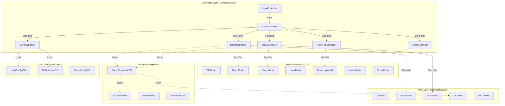
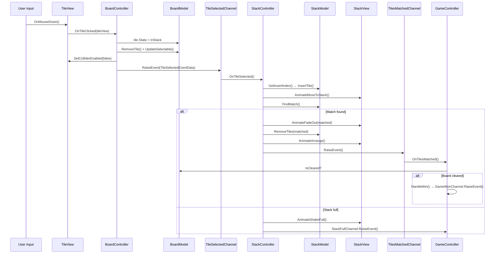

# 🏗️ Kiến Trúc MVC — Pirate Tiles

> Tài liệu thiết kế kiến trúc MVC cho dự án Pirate Tiles.  
> Mục tiêu: Xây dựng codebase theo mô hình **Model – View – Controller** rõ ràng, dễ bảo trì, dễ test.  
> Giao tiếp giữa các layer sử dụng **Event Channel (ScriptableObject-based)** thay vì EventBus.

---

## 1. Tổng Quan Kiến Trúc

### 1.1 Triết lý thiết kế

| Nguyên tắc | Áp dụng |
|---|---|
| **Separation of Concerns** | Model không biết View, View không chứa logic, Controller là cầu nối |
| **Single Responsibility** | Mỗi class chỉ làm một việc |
| **Event-Driven** | Các layer giao tiếp qua **Event Channel SO**, không reference trực tiếp |
| **Dependency Injection (thủ công)** | Controller nhận Model/View qua constructor hoặc `[SerializeField]` |
| **Testability** | Model là pure C# class, có thể unit test không cần Unity |

### 1.2 Sơ đồ kiến trúc tổng thể



---

## 2. Event Channel — Hệ Thống Giao Tiếp

### 2.1 Khái niệm

**Event Channel** là các **ScriptableObject** đóng vai trò kênh truyền thông giữa các thành phần. Thay vì dùng static `EventBus`, mỗi sự kiện được đại diện bởi một **SO asset** có thể cấu hình và debug trong Inspector.

### 2.2 Cấu trúc Event Channel

```csharp
// === Base Event Channel (không tham số) ===
[CreateAssetMenu(menuName = "PirateTiles/Events/Void Event Channel")]
public class VoidEventChannelSO : ScriptableObject {
    private Action _onEventRaised;

    public void RaiseEvent() {
        _onEventRaised?.Invoke();
    }

    public void Subscribe(Action listener) {
        _onEventRaised += listener;
    }

    public void Unsubscribe(Action listener) {
        _onEventRaised -= listener;
    }
}

// === Generic Event Channel (1 tham số) ===
public abstract class EventChannelSO<T> : ScriptableObject {
    private Action<T> _onEventRaised;

    public void RaiseEvent(T value) {
        _onEventRaised?.Invoke(value);
    }

    public void Subscribe(Action<T> listener) {
        _onEventRaised += listener;
    }

    public void Unsubscribe(Action<T> listener) {
        _onEventRaised -= listener;
    }
}

// === Typed Event Channels ===
[CreateAssetMenu(menuName = "PirateTiles/Events/Tile Selected Channel")]
public class TileSelectedChannelSO : EventChannelSO<TileSelectedEventData> { }

[CreateAssetMenu(menuName = "PirateTiles/Events/Bool Event Channel")]
public class BoolEventChannelSO : EventChannelSO<bool> { }

[CreateAssetMenu(menuName = "PirateTiles/Events/Int Event Channel")]
public class IntEventChannelSO : EventChannelSO<int> { }

// === Event Data Structs ===
public struct TileSelectedEventData {
    public TileModel Tile;
    public TileView TileView;
}

public struct PowerUpUsedEventData {
    public PowerType Type;
}
```

### 2.3 Danh sách Event Channels

| Event Channel SO | Kiểu dữ liệu | Publisher | Subscriber |
|---|---|---|---|
| `TileSelectedChannel` | `TileSelectedEventData` | `BoardController` | `StackController` |
| `TilesMatchedChannel` | `VoidEventChannelSO` | `StackController` | `GameController`, `AudioController` |
| `GameWonChannel` | `VoidEventChannelSO` | `GameController` | `WinPanelView`, `AudioController` |
| `GameLostChannel` | `VoidEventChannelSO` | `GameController` | `LosePanelView`, `AudioController` |
| `GamePausedChannel` | `BoolEventChannelSO` | `GameController` | `TimerController`, `AudioController` |
| `TimerExpiredChannel` | `VoidEventChannelSO` | `TimerController` | `GameController` |
| `StackFullChannel` | `VoidEventChannelSO` | `StackController` | `GameController` |
| `BoardClearedChannel` | `VoidEventChannelSO` | `BoardController` | `GameController` |
| `PowerUpUsedChannel` | `EventChannelSO<PowerUpUsedEventData>` | `PowerUpController` | `AudioController` |
| `CoinsChangedChannel` | `IntEventChannelSO` | `CoinsController` | `CoinsView` |
| `HeartsChangedChannel` | `IntEventChannelSO` | `HeartsController` | `HeartsView` |
| `LevelStartedChannel` | `IntEventChannelSO` | `LevelController` | `AudioController` |
| `UndoRequestChannel` | `VoidEventChannelSO` | `PowerUpController` | `BoardController`, `StackController` |
| `ShuffleCompletedChannel` | `VoidEventChannelSO` | `BoardController` | `TimerController` |
| `SpendCoinsRequestChannel` | `EventChannelSO<PowerType>` | `PowerUpController` | `CoinsController` |
| `OutOfHeartsChannel` | `VoidEventChannelSO` | `HeartsController` | `OutOfHeartPanelView` |

### 2.4 Cách sử dụng Event Channel

```csharp
// === Controller inject Event Channel qua SerializeField ===
public class BoardController : MonoBehaviour {
    [Header("Event Channels")]
    [SerializeField] private TileSelectedChannelSO _tileSelectedChannel;
    [SerializeField] private VoidEventChannelSO _boardClearedChannel;

    private void HandleNormalTile(TileModel model, TileView view) {
        // ... update model ...
        // Raise event qua channel
        _tileSelectedChannel.RaiseEvent(new TileSelectedEventData {
            Tile = model,
            TileView = view
        });
    }
}

// === Subscriber ===
public class StackController : MonoBehaviour {
    [SerializeField] private TileSelectedChannelSO _tileSelectedChannel;

    private void OnEnable() {
        _tileSelectedChannel.Subscribe(OnTileSelected);
    }

    private void OnDisable() {
        _tileSelectedChannel.Unsubscribe(OnTileSelected);
    }

    private void OnTileSelected(TileSelectedEventData data) {
        // Handle tile
    }
}
```

### 2.5 Ưu điểm Event Channel SO vs EventBus

| | EventBus (static) | Event Channel SO |
|---|---|---|
| **Coupling** | Thấp (type-based) | **Rất thấp** (SO reference) |
| **Debug** | Khó (code only) | **Dễ** (Inspector, có thể add debug log) |
| **Config** | Hardcoded | **Inspector-configurable** |
| **Scene Independence** | Global static | **Per-scene hoặc shared** |
| **Memory Leak** | Dễ quên unsubscribe | **Dễ kiểm soát** (OnDisable) |
| **Testing** | Mock khó | **Dễ mock** (tạo SO test) |

---

## 3. Các Layer Chi Tiết

### 3.1 Model Layer — Dữ liệu & Logic thuần

> **Quy tắc:**  
> - ❌ KHÔNG kế thừa `MonoBehaviour`  
> - ❌ KHÔNG reference `UnityEngine` (trừ `Vector3`, `Mathf` khi cần)  
> - ✅ Pure C# class  
> - ✅ Có thể unit test độc lập  
> - ✅ Chứa toàn bộ business logic

#### Danh sách Model

| Model | Trách nhiệm | Dữ liệu chính |
|---|---|---|
| `TileModel` | Dữ liệu 1 lá bài | `TileType`, `TileState`, `GridPosition`, `LayerIndex`, `IsSelectable` |
| `BoardModel` | Trạng thái toàn bộ bàn cờ | `List<TileModel>`, logic overlap, logic check win |
| `StackModel` | Trạng thái khay chứa | `List<TileModel>`, logic match-3, logic insert, check full |
| `LevelModel` | Dữ liệu level hiện tại | `LevelIndex`, `TimeLimit`, `MaxStackSize` |
| `PowerUpModel` | Trạng thái power-up | `Dictionary<PowerType, int>` counts |
| `HeartsModel` | Hệ thống mạng sống | `CurrentHearts`, `MaxHearts`, `HealTime`, `LastHealTimestamp` |
| `CoinsModel` | Hệ thống tiền tệ | `CurrentCoins`, `PowerCost` |
| `TileHistoryModel` | Lịch sử chọn bài | `Stack<TileMoveRecord>` |
| `GameStateModel` | Trạng thái game | `IsPaused`, `IsProcessing`, `GamePhase` enum |

#### Chi tiết thiết kế Model

```csharp
// ==================== TileModel ====================
public class TileModel {
    public int Id { get; }
    public TileType TileType { get; set; }
    public TileState State { get; set; }
    public Vector2Int GridPosition { get; }
    public int LayerIndex { get; }
    public bool IsSelectable { get; set; }
    public bool IsSpecialTile => TileType >= TileType.STile_A;
}

// ==================== BoardModel ====================
public class BoardModel {
    private List<TileModel> _tiles;
    private Dictionary<int, List<int>> _overlapMap;

    public IReadOnlyList<TileModel> Tiles => _tiles.AsReadOnly();
    public int RemainingTiles => _tiles.Count(t => t.State == TileState.InBoard);

    public void RemoveTile(int tileId) { ... }
    public List<int> GetTilesAbove(int tileId) { ... }
    public List<int> GetTilesBelow(int tileId) { ... }
    public void UpdateSelectableStatus() { ... }
    public bool IsCleared => RemainingTiles <= 0;
    public List<TileModel> GetTilesByType(TileType type) { ... }
    public void ShuffleTileTypes() { ... }
}

// ==================== StackModel ====================
public class StackModel {
    private List<TileModel> _tiles;
    public int MaxSize { get; set; }

    public IReadOnlyList<TileModel> Tiles => _tiles.AsReadOnly();
    public int Count => _tiles.Count;
    public bool IsFull => Count >= MaxSize;

    public int GetInsertIndex(TileType type) { ... }
    public void InsertTile(int index, TileModel tile) { ... }
    public void RemoveTile(TileModel tile) { ... }
    public int FindMatch() { ... }
    public List<TileModel> GetMatchedTiles(int matchIndex) { ... }
    public (TileType type, int count) GetMostFrequentType() { ... }
    public void ExpandSize() { MaxSize++; }
}

// ==================== GameStateModel ====================
public enum GamePhase {
    Initializing,
    ShuffleIntro,
    Playing,
    Paused,
    Won,
    Lost
}

public class GameStateModel {
    public GamePhase Phase { get; set; }
    public bool IsProcessingTile { get; set; }
    public bool IsUsingPower { get; set; }
    public bool IsAnimating { get; set; }

    public bool CanInteract =>
        Phase == GamePhase.Playing
        && !IsProcessingTile
        && !IsUsingPower
        && !IsAnimating;
}
```

---

### 3.2 View Layer — Hiển thị & Animation

> **Quy tắc:**  
> - ✅ Kế thừa `MonoBehaviour`  
> - ✅ Xử lý rendering, animation, VFX, UI display  
> - ❌ KHÔNG chứa business logic  
> - ❌ KHÔNG trực tiếp thay đổi Model  
> - ✅ Expose public methods để Controller gọi

#### Danh sách View

| View | Trách nhiệm |
|---|---|
| `TileView` | Render sprite, VFX dim/brighten, animation di chuyển, dissolve effect |
| `BoardView` | Quản lý tất cả `TileView`, spawn/despawn, cập nhật visual |
| `StackView` | Render stack UI, animation add/remove/arrange |
| `TimerView` | Hiển thị countdown timer |
| `WinPanelView` | Animation + UI khi thắng |
| `LosePanelView` | Animation + UI khi thua |
| `SettingPanelView` | UI Settings (Music, SFX, Resume, Replay) |
| `HeartsView` | Hiển thị hearts + countdown heal |
| `CoinsView` | Hiển thị số coins |
| `PowerUpBarView` | Hiển thị 4 nút power-up + số lượt |
| `MapView` | Render level map, stars, lock/unlock buttons |
| `TutorialView` | Hiển thị hướng dẫn từng bước |
| `LoadingView` | Loading screen + progress bar |

#### Chi tiết View

```csharp
public class TileView : MonoBehaviour {
    [SerializeField] private SpriteRenderer _spriteRenderer;
    [SerializeField] private BoxCollider _collider;

    public void SetSprite(Sprite sprite) { ... }
    public void SetSelectable(bool selectable) { ... }
    public void SetColliderEnabled(bool enabled) { ... }

    public Tween AnimateMoveToStack(Vector3 target, float duration) { ... }
    public Tween AnimateMoveToPosition(Vector3 target, float duration) { ... }
    public Tween AnimateUndoMove(Vector3 target) { ... }
    public Tween AnimateFadeOut(float duration) { ... }

    private void OnMouseDown() {
        OnTileClicked?.Invoke(this);
    }
    public event Action<TileView> OnTileClicked;
}
```

---

### 3.3 Controller Layer — Điều phối & Logic flow

> **Quy tắc:**  
> - ✅ Kế thừa `MonoBehaviour`  
> - ✅ Xử lý input → cập nhật Model → cập nhật View  
> - ✅ Raise/Subscribe events qua **Event Channel SO**  
> - ❌ KHÔNG render, animation  
> - ❌ KHÔNG chứa dữ liệu state

#### Chi tiết Controller chính

```csharp
public class GameController : MonoBehaviour {
    [Header("Controllers")]
    [SerializeField] private BoardController _boardController;
    [SerializeField] private StackController _stackController;
    [SerializeField] private PowerUpController _powerUpController;
    [SerializeField] private TimerController _timerController;

    [Header("Event Channels")]
    [SerializeField] private VoidEventChannelSO _tilesMatchedChannel;
    [SerializeField] private VoidEventChannelSO _stackFullChannel;
    [SerializeField] private VoidEventChannelSO _timerExpiredChannel;
    [SerializeField] private VoidEventChannelSO _gameWonChannel;
    [SerializeField] private VoidEventChannelSO _gameLostChannel;

    private GameStateModel _gameState;

    private void OnEnable() {
        _tilesMatchedChannel.Subscribe(OnTilesMatched);
        _stackFullChannel.Subscribe(OnStackFull);
        _timerExpiredChannel.Subscribe(OnTimerExpired);
    }

    private void OnDisable() {
        _tilesMatchedChannel.Unsubscribe(OnTilesMatched);
        _stackFullChannel.Unsubscribe(OnStackFull);
        _timerExpiredChannel.Unsubscribe(OnTimerExpired);
    }

    private void HandleWin() {
        _gameState.Phase = GamePhase.Won;
        _timerController.StopTimer();
        _gameWonChannel.RaiseEvent();
    }

    private void HandleLose() {
        _gameState.Phase = GamePhase.Lost;
        _timerController.StopTimer();
        _gameLostChannel.RaiseEvent();
    }
}
```

---

### 3.4 Services Layer

> Singleton (DontDestroyOnLoad), không phụ thuộc vào Controller/View cụ thể.

| Service | Trách nhiệm |
|---|---|
| `AudioService` | Quản lý BGM, SFX qua AudioMixer |
| `SaveService` | Wrapper PlayerPrefs + domain-specific methods |
| `SceneService` | Chuyển scene async với loading screen |

---

### 3.5 Data Layer — ScriptableObject

| ScriptableObject | Nội dung |
|---|---|
| `TileDatabaseSO` | Mảng `TileData` (TileType + Sprite) cho mỗi bộ bài |
| `LevelConfigSO` | Cấu hình: time limit, stack size, tile layout |
| `GameConfigSO` | Cấu hình chung: max hearts, heal time, power cost |
| `AudioConfigSO` | Mapping SoundEffect enum → AudioClip |

---

## 4. Luồng Dữ Liệu (Data Flow)

### 4.1 Click lá bài → Match



### 4.2 Quy tắc Data Flow

```
📌 QUY TẮC VÀNG:

   User Input → Controller → Model (update data)
                           → View (update display)
                           → Event Channel (notify others)

   ❌ View KHÔNG BAO GIỜ gọi Model
   ❌ Model KHÔNG BAO GIỜ gọi View
   ❌ Controller A KHÔNG gọi trực tiếp Controller B
      → Dùng Event Channel SO để giao tiếp
```

---

## 5. Cấu Trúc Thư Mục MVC

```
Assets/
├── _PirateTiles/
│   ├── Scripts/
│   │   ├── Models/
│   │   ├── Views/
│   │   │   ├── Tile/
│   │   │   ├── Board/
│   │   │   ├── Stack/
│   │   │   ├── UI/
│   │   │   └── Tutorial/
│   │   ├── Controllers/
│   │   ├── Services/
│   │   ├── Data/
│   │   │   ├── Enums/
│   │   │   ├── EventChannels/
│   │   │   ├── EventData/
│   │   │   └── ScriptableObjects/
│   │   ├── Utils/
│   │   └── Editor/
│   ├── Scenes/
│   ├── Prefabs/
│   ├── Resources/
│   │   ├── TileData/
│   │   ├── LevelConfigs/
│   │   ├── LevelPrefabs/
│   │   ├── EventChannels/
│   │   └── GameConfig.asset
│   ├── Art/
│   ├── Audio/
│   ├── Materials/
│   └── Shaders/
├── Plugins/
└── Packages/
```

---

## 6. Scene & Prefab Setup

### Prefab: `GameManager` (DontDestroyOnLoad)

```
GameManager (GameObject)
├── AudioService
├── SaveService
├── SceneService
└── (Event Channel SO là assets, không cần MonoBehaviour)
```

### Scene: `InGame` — Hierarchy

```
InGame (Scene)
├── GameController
│   ├── BoardController → BoardView → [TileView instances]
│   ├── StackController → StackView → SlotPositions
│   ├── PowerUpController → PowerUpBarView
│   ├── TimerController → TimerView
│   ├── HeartsController → HeartsView
│   └── CoinsController → CoinsView
├── Canvas
│   ├── WinPanelView
│   ├── LosePanelView
│   └── SettingPanelView
├── Camera
└── Background
```

---

> **Ghi chú:** Kiến trúc này dùng **Event Channel SO** thay vì EventBus static. Mỗi event là một SO asset có thể debug trực tiếp trong Inspector, dễ track và giảm memory leak risk.
