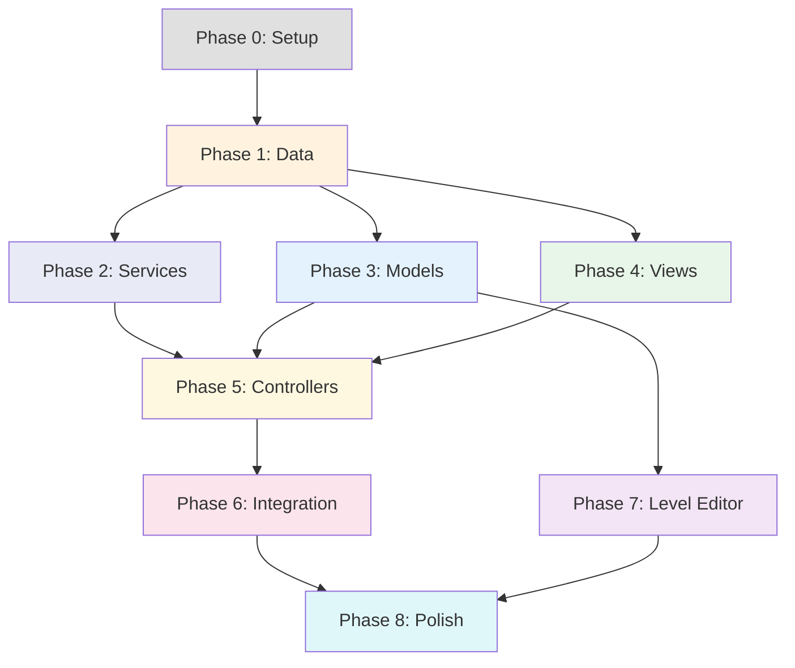

# 📋 Task Breakdown — Wonder Match MVC Rebuild

> Phân rã toàn bộ công việc để xây dựng lại dự án Wonder Match theo kiến trúc MVC.  
> Tham chiếu: `_02.Architecture.md`

---

## Quy ước

| Ký hiệu | Ý nghĩa |
|---|---|
| 🔴 | Ưu tiên cao (Critical Path) |
| 🟡 | Ưu tiên trung bình |
| 🟢 | Ưu tiên thấp / Nice-to-have |
| `[M]` | Model |
| `[V]` | View |
| `[C]` | Controller |
| `[S]` | Service |
| `[D]` | Data / ScriptableObject |
| `[E]` | Editor Tool |
| `[T]` | Unit Test |

---

## Phase 0: Khởi tạo dự án (Setup)

> **Mục tiêu:** Cấu trúc thư mục, cài đặt dependencies, project settings.

| # | Task | Loại | Ưu tiên | Ước tính |
|---|---|---|---|---|
| 0.1 | Tạo cấu trúc thư mục MVC (`_Game/Scripts/Models`, `Views`, `Controllers`, `Services`, `Data`, `Utils`, `Editor`) | Setup | 🔴 | 0.5h |
| 0.2 | Import plugin DOTween, TextMesh Pro | Setup | 🔴 | 0.5h |
| 0.3 | Cấu hình Project Settings (Resolution: Portrait, Target: Android/iOS) | Setup | 🔴 | 0.5h |
| 0.4 | Tạo các Scene rỗng: `GameMode`, `InGame`, `Loading`, `Map`, `Tutorial` | Setup | 🔴 | 0.5h |
| 0.5 | Tạo `.gitignore` phù hợp cho Unity | Setup | 🟡 | 0.25h |

**Deliverable:** Dự án Unity sạch với cấu trúc thư mục MVC hoàn chỉnh.

---

## Phase 1: Data Layer — Enums, Constants, ScriptableObjects

> **Mục tiêu:** Định nghĩa tất cả kiểu dữ liệu nền tảng.

| # | Task | Loại | Ưu tiên | Ước tính |
|---|---|---|---|---|
| 1.1 | Tạo enum `CardType` (nothing, cardA–cardK, SCard_A–SCard_D) | `[D]` | 🔴 | 0.25h |
| 1.2 | Tạo enum `CardState` (InBoard, InStack) | `[D]` | 🔴 | 0.1h |
| 1.3 | Tạo enum `PowerType` (Undo, Magic, Shuffle, AddOneCell) | `[D]` | 🔴 | 0.1h |
| 1.4 | Tạo enum `PlayerID` (A, B) | `[D]` | 🟡 | 0.1h |
| 1.5 | Tạo enum `SoundEffect` (25+ types) | `[D]` | 🔴 | 0.25h |
| 1.6 | Tạo enum `GamePhase` (Initializing, ShuffleIntro, Playing, Paused, Won, Lost) | `[D]` | 🔴 | 0.1h |
| 1.7 | Tạo `SaveKeys.cs` — hằng số key cho PlayerPrefs | `[D]` | 🔴 | 0.25h |
| 1.8 | Tạo `CardDatabaseSO` (ScriptableObject: CardData[]) + tạo 4 asset (BICH, CO, RO, TEP) | `[D]` | 🔴 | 1h |
| 1.9 | Tạo `LevelConfigSO` (ScriptableObject: levelIndex, timeLimit, maxStackSize) | `[D]` | 🔴 | 0.5h |
| 1.10 | Tạo `GameConfigSO` (ScriptableObject: hearts, coins, power-up config) | `[D]` | 🔴 | 0.5h |
| 1.11 | Tạo `AudioConfigSO` (ScriptableObject: SoundEffect → AudioClip mapping) | `[D]` | 🟡 | 0.5h |
| 1.12 | Tạo interface `IGameEvent` + tất cả Event records/classes | `[D]` | 🔴 | 0.5h |

**Deliverable:** Tất cả enum, SO, event definitions biên dịch thành công. Các SO asset được tạo trong Editor.

---

## Phase 2: Services Layer — Hạ tầng

> **Mục tiêu:** Xây dựng các service singleton xuyên suốt game.

| # | Task | Loại | Ưu tiên | Ước tính |
|---|---|---|---|---|
| 2.1 | Implement `EventBus` (Subscribe, Unsubscribe, Publish, Clear) | `[S]` | 🔴 | 1.5h |
| 2.2 | Viết unit test cho EventBus (subscribe, publish, multi-subscriber, unsubscribe) | `[T]` | 🔴 | 1h |
| 2.3 | Implement `SaveService` (wrapper PlayerPrefs + domain methods) | `[S]` | 🔴 | 1h |
| 2.4 | Implement `AudioService` (init sounds, Play, Pause, Toggle Music/SFX) | `[S]` | 🔴 | 2h |
| 2.5 | Implement `SceneService` (LoadScene with loading screen, async) | `[S]` | 🔴 | 1.5h |
| 2.6 | Tạo prefab `GameManager` (chứa 3 service, DontDestroyOnLoad) | `[S]` | 🔴 | 0.5h |
| 2.7 | Viết unit test cho SaveService | `[T]` | 🟡 | 0.5h |

**Deliverable:** 4 service singleton hoạt động, EventBus tested, GameManager prefab sẵn sàng.

---

## Phase 3: Model Layer — Logic nghiệp vụ

> **Mục tiêu:** Implement toàn bộ logic thuần C# (không cần Unity).  
> **Quan trọng:** Đây là phần CẦN UNIT TEST nhiều nhất.

### 3A. CardModel & BoardModel

| # | Task | Loại | Ưu tiên | Ước tính |
|---|---|---|---|---|
| 3.1 | Implement `CardModel` (properties, IsSpecialCard) | `[M]` | 🔴 | 0.5h |
| 3.2 | Implement `BoardModel` — khởi tạo từ danh sách CardModel | `[M]` | 🔴 | 1h |
| 3.3 | Implement `BoardModel.UpdateSelectableStatus()` — logic overlap theo layer/position | `[M]` | 🔴 | 2h |
| 3.4 | Implement `BoardModel.RemoveCard()` + auto update selectable | `[M]` | 🔴 | 1h |
| 3.5 | Implement `BoardModel.ShuffleCardTypes()` — Fisher-Yates shuffle | `[M]` | 🔴 | 1h |
| 3.6 | Implement `BoardModel.GetCardsByType()` | `[M]` | 🟡 | 0.5h |
| 3.7 | Viết unit test BoardModel (overlap, remove, shuffle, selectable, win condition) | `[T]` | 🔴 | 3h |

### 3B. StackModel

| # | Task | Loại | Ưu tiên | Ước tính |
|---|---|---|---|---|
| 3.8 | Implement `StackModel` — InsertCard, RemoveCard, MaxSize | `[M]` | 🔴 | 1h |
| 3.9 | Implement `StackModel.GetInsertIndex()` — smart insert cạnh bài cùng loại | `[M]` | 🔴 | 1h |
| 3.10 | Implement `StackModel.FindMatch()` — tìm 3 bài liên tiếp cùng loại | `[M]` | 🔴 | 1h |
| 3.11 | Implement `StackModel.GetMostFrequentType()` — hỗ trợ Magic/Shuffle | `[M]` | 🔴 | 0.5h |
| 3.12 | Implement `StackModel.ExpandSize()` — AddOneCell logic | `[M]` | 🟡 | 0.25h |
| 3.13 | Viết unit test StackModel (insert, match, full, smart insert, expand) | `[T]` | 🔴 | 3h |

### 3C. Các Model phụ trợ

| # | Task | Loại | Ưu tiên | Ước tính |
|---|---|---|---|---|
| 3.14 | Implement `GameStateModel` (Phase, CanInteract logic) | `[M]` | 🔴 | 0.5h |
| 3.15 | Implement `CardHistoryModel` (Push, UndoLast) | `[M]` | 🔴 | 0.5h |
| 3.16 | Implement `PowerUpModel` (counts dict, UseOne, Reset, HasRemaining) | `[M]` | 🔴 | 1h |
| 3.17 | Implement `HeartsModel` (LoseHeart, HealHeart, RecoverOffline, TimeUntilNextHeal) | `[M]` | 🔴 | 1.5h |
| 3.18 | Implement `CoinsModel` (Add, TrySpend, CanBuy) | `[M]` | 🟡 | 0.5h |
| 3.19 | Implement `PlayerModel` (Score, PlayerID) | `[M]` | 🟢 | 0.25h |
| 3.20 | Implement `LevelModel` (LevelIndex, TimeLimit, unlock logic) | `[M]` | 🔴 | 0.5h |
| 3.21 | Viết unit test cho PowerUpModel, HeartsModel, CoinsModel | `[T]` | 🔴 | 2h |
| 3.22 | Viết unit test cho CardHistoryModel, GameStateModel | `[T]` | 🟡 | 1h |

**Deliverable:** Tất cả Model biên dịch + 100% unit test pass. Logic game core hoàn chỉnh mà chưa cần Unity.

---

## Phase 4: View Layer — Hiển thị

> **Mục tiêu:** Tạo tất cả UI/visual components.

### 4A. Card & Board Views

| # | Task | Loại | Ưu tiên | Ước tính |
|---|---|---|---|---|
| 4.1 | Tạo prefab `Card` + implement `CardView` (sprite, collider, input event) | `[V]` | 🔴 | 1.5h |
| 4.2 | Implement `CardView` animation: MoveToStack (DOTween Sequence) | `[V]` | 🔴 | 1.5h |
| 4.3 | Implement `CardView` animation: MoveToPosition, UndoMove | `[V]` | 🔴 | 1h |
| 4.4 | Implement `CardView` animation: FadeOut (dissolve shader) | `[V]` | 🔴 | 1h |
| 4.5 | Implement `CardView` animation: Collect (special card zoom + fade) | `[V]` | 🟡 | 1h |
| 4.6 | Implement `CardVFXView` (MaterialPropertyBlock: brightness, dissolve) | `[V]` | 🔴 | 1h |
| 4.7 | Implement `CardView.SetSelectable()` — Dim/Brighten visual | `[V]` | 🔴 | 0.5h |
| 4.8 | Implement `BoardView` (SpawnCards, DespawnCard, SyncSelectable) | `[V]` | 🔴 | 2h |
| 4.9 | Implement BoardView shuffle animations (spread, circle, fan-out) | `[V]` | 🔴 | 3h |

### 4B. Stack View

| # | Task | Loại | Ưu tiên | Ước tính |
|---|---|---|---|---|
| 4.10 | Setup StackView với slot positions (Transform array) | `[V]` | 🔴 | 0.5h |
| 4.11 | Implement `StackView.AnimateArrange()` — sắp xếp lại vị trí | `[V]` | 🔴 | 1h |
| 4.12 | Implement `StackView.AnimateShakeFull()` — animation stack đầy | `[V]` | 🔴 | 0.5h |

### 4C. UI Views

| # | Task | Loại | Ưu tiên | Ước tính |
|---|---|---|---|---|
| 4.13 | Implement `TimerView` (countdown text, visual warning) | `[V]` | 🔴 | 1h |
| 4.14 | Implement `WinPanelView` (drop-in animation, banner, coins count-up, VFX) | `[V]` | 🔴 | 3h |
| 4.15 | Implement `LosePanelView` (scale-in animation, replay/revive buttons) | `[V]` | 🔴 | 2h |
| 4.16 | Implement `HeartsView` (hearts count, heal countdown text) | `[V]` | 🔴 | 1h |
| 4.17 | Implement `CoinsView` (coins count text) | `[V]` | 🟡 | 0.5h |
| 4.18 | Implement `PowerUpBarView` (4 buttons + count texts + events) | `[V]` | 🔴 | 1.5h |
| 4.19 | Implement `SettingPanelView` (Music/SFX toggles, Continue, Replay, Map buttons) | `[V]` | 🟡 | 1.5h |
| 4.20 | Implement `MapView` (level buttons, stars, lock/unlock) | `[V]` | 🔴 | 2h |
| 4.21 | Implement `LoadingView` (loading screen, progress) | `[V]` | 🟡 | 1h |
| 4.22 | Implement `TutorialView` (step-based UI, skip button) | `[V]` | 🟢 | 1.5h |
| 4.23 | Thiết kế UI layout cho tất cả panel (Canvas prefabs) | `[V]` | 🔴 | 4h |
| 4.24 | Implement `OutOfHeartPanelView` | `[V]` | 🟡 | 1h |
| 4.25 | Implement `SpendCoinsPanelView` (popup mua power-up) | `[V]` | 🟡 | 1h |

**Deliverable:** Tất cả View có thể hiển thị đúng trong Scene (chưa cần logic).

---

## Phase 5: Controller Layer — Kết nối M ↔ V

> **Mục tiêu:** Ghép Model với View, xử lý game flow.

### 5A. Core Controllers

| # | Task | Loại | Ưu tiên | Ước tính |
|---|---|---|---|---|
| 5.1 | Implement `GameController` — quản lý GamePhase, init level, win/lose flow | `[C]` | 🔴 | 3h |
| 5.2 | Implement `BoardController` — click bài, update overlap, sync view | `[C]` | 🔴 | 3h |
| 5.3 | Implement `StackController` — nhận bài, match detection, remove, arrange | `[C]` | 🔴 | 3h |
| 5.4 | Implement `TimerController` — start/stop timer, trigger lose | `[C]` | 🔴 | 1h |
| 5.5 | Implement `LevelController` — load level config, load level prefab, unlock | `[C]` | 🔴 | 2h |

### 5B. Support Controllers

| # | Task | Loại | Ưu tiên | Ước tính |
|---|---|---|---|---|
| 5.6 | Implement `PowerUpController` — Undo logic (history ↔ board ↔ stack) | `[C]` | 🔴 | 2h |
| 5.7 | Implement `PowerUpController` — Magic logic (find cards on board → push to stack) | `[C]` | 🔴 | 2h |
| 5.8 | Implement `PowerUpController` — Shuffle logic (shuffle board + swap specific) | `[C]` | 🔴 | 2h |
| 5.9 | Implement `PowerUpController` — AddOneCell logic | `[C]` | 🟡 | 0.5h |
| 5.10 | Implement `HeartsController` — heal timer, lose heart, UI sync | `[C]` | 🔴 | 1.5h |
| 5.11 | Implement `CoinsController` — earn on win, spend on power-up, UI sync | `[C]` | 🟡 | 1h |
| 5.12 | Implement `AudioController` — subscribe events → play sounds | `[C]` | 🔴 | 1.5h |
| 5.13 | Implement `TutorialController` — step flow, skip, first-time check | `[C]` | 🟢 | 2h |

**Deliverable:** Game chơi được end-to-end: chọn level → chơi → thắng/thua → quay về map.

---

## Phase 6: Scene Setup & Integration

> **Mục tiêu:** Lắp ráp các component vào Scene, test integration.

| # | Task | Loại | Ưu tiên | Ước tính |
|---|---|---|---|---|
| 6.1 | Setup Scene `GameMode` — GameModeManager prefab, chọn mode | Integ | 🔴 | 1h |
| 6.2 | Setup Scene `InGame` — GameController + tất cả sub-controllers + views | Integ | 🔴 | 2h |
| 6.3 | Setup Scene `Map` — LevelController + MapView + HeartsView | Integ | 🔴 | 1.5h |
| 6.4 | Setup Scene `Loading` — LoadingView | Integ | 🟡 | 0.5h |
| 6.5 | Setup Scene `Tutorial` — TutorialController + TutorialView | Integ | 🟢 | 1h |
| 6.6 | Test luồng chuyển scene: GameMode → Map → InGame → Win/Lose → Map | Integ | 🔴 | 2h |
| 6.7 | Test Hearts system cross-scene (heal timer, lose on play) | Integ | 🔴 | 1h |
| 6.8 | Test Coins system cross-scene (earn, spend, persist) | Integ | 🟡 | 0.5h |

**Deliverable:** Game chạy liền mạch qua tất cả scene.

---

## Phase 7: Level Content & Editor

> **Mục tiêu:** Tạo tool thiết kế level + tạo content.

| # | Task | Loại | Ưu tiên | Ước tính |
|---|---|---|---|---|
| 7.1 | Implement `LevelEditorWindow` (EditorWindow: grid, card selection, tabs) | `[E]` | 🔴 | 4h |
| 7.2 | Implement tab "Cards In Use" — thống kê bài đã đặt | `[E]` | 🟡 | 1h |
| 7.3 | Implement tab "Cards Missing" — kiểm tra chia hết cho 3 | `[E]` | 🟡 | 1h |
| 7.4 | Tạo Level 1–3 (dễ, tutorial-friendly) | Content | 🔴 | 3h |
| 7.5 | Tạo Level 4–8 (trung bình) | Content | 🟡 | 4h |
| 7.6 | Tạo Level 9–12 (khó) | Content | 🟡 | 4h |
| 7.7 | Tạo `LevelConfigSO` asset cho mỗi level (thời gian, stack size) | `[D]` | 🔴 | 1h |

**Deliverable:** 12 levels playable, Level Editor hoạt động.

---

## Phase 8: Polish & Optimization

> **Mục tiêu:** Hoàn thiện trải nghiệm, sửa bug, tối ưu.

| # | Task | Loại | Ưu tiên | Ước tính |
|---|---|---|---|---|
| 8.1 | Import + gắn Art assets (background, UI, card sprites) | Art | 🔴 | 3h |
| 8.2 | Import + gắn Audio assets (BGM, SFX mapping) | Audio | 🔴 | 2h |
| 8.3 | Implement card suit selection (Slot machine / chọn bộ bài) | Feature | 🟡 | 3h |
| 8.4 | Implement Collection / Bookmark system (SCard) | Feature | 🟢 | 4h |
| 8.5 | Implement Star rating system (tính sao dựa trên thời gian) | Feature | 🟡 | 2h |
| 8.6 | Implement Revive (watch ad → undo 3 bài + reset timer) | Feature | 🟡 | 1.5h |
| 8.7 | Implement Duo Mode (2 players, turn switching) | Feature | 🟢 | 4h |
| 8.8 | Performance profiling (Profiler, batching, GC) | Optimize | 🟡 | 2h |
| 8.9 | Memory leak check (DOTween kill, event unsubscribe) | Optimize | 🔴 | 2h |
| 8.10 | Bug fixing & edge cases | QA | 🔴 | 4h |
| 8.11 | Final playtest — all 12 levels | QA | 🔴 | 3h |

---

## Tóm Tắt Ước Tính

| Phase | Mô tả | Ước tính (giờ) |
|---|---|---|
| Phase 0 | Setup | **2h** |
| Phase 1 | Data Layer | **4h** |
| Phase 2 | Services | **7h** |
| Phase 3 | Model Layer + Tests | **22h** |
| Phase 4 | View Layer | **32h** |
| Phase 5 | Controller Layer | **25h** |
| Phase 6 | Scene Integration | **10h** |
| Phase 7 | Level Editor + Content | **18h** |
| Phase 8 | Polish + QA | **31h** |
| | **TỔNG** | **~150h** |

---

## Dependency Chart — Thứ tự thực hiện

> **Lưu ý:** Phase 3 (Models) và Phase 4 (Views) có thể làm **song song** bởi 2 người. Phase 5 (Controllers) là **bottleneck** — cần cả 2 hoàn thành trước.

---

## Phân công đề xuất (2 Dev)

| Dev | Trách nhiệm chính | Phase |
|---|---|---|
| **Dev 1 (Logic)** | Data, Services, Models, Controllers, Tests | P0 → P1 → P2 → P3 → P5 |
| **Dev 2 (Visual)** | Views, UI Layout, Art/Audio integration, Level Content | P0 → P1 → P4 → P7 → P8 |
| **Cả 2** | Integration, Polish, QA | P6 → P8 |
