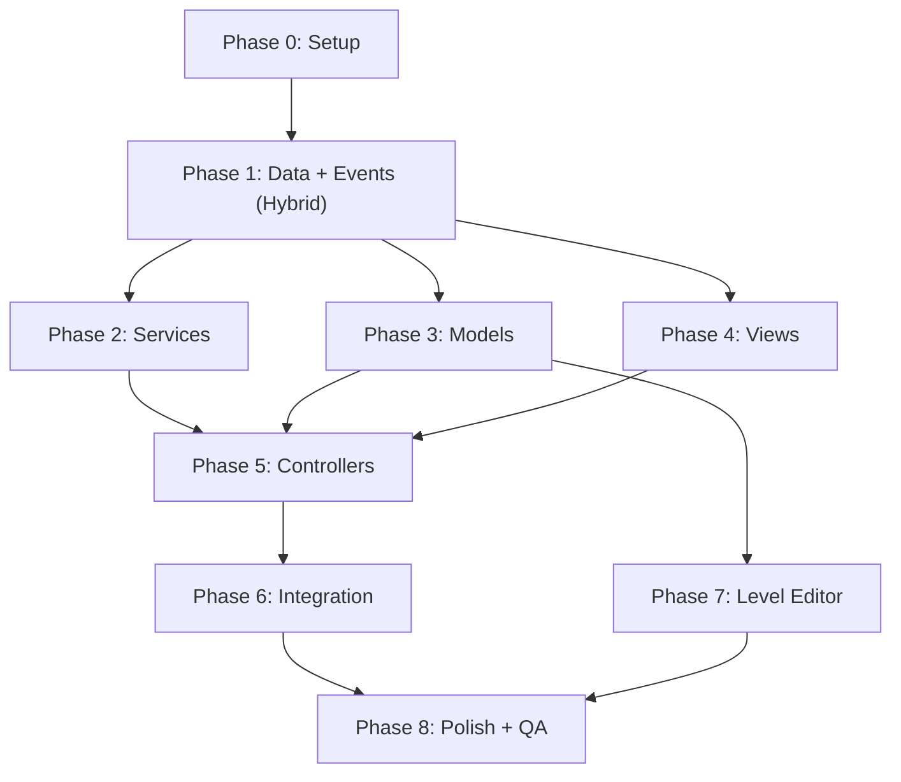

# 📋 Task Breakdown — Pirate Tiles

> Phân rã toàn bộ công việc để xây dựng dự án Pirate Tiles theo kiến trúc MVC + Hybrid Event System.  
> Tham chiếu: `_02.Architecture.md`

---

## Quy ước

| Ký hiệu | Ý nghĩa |
|---|---|
| 🔴 | Ưu tiên cao (Critical Path) |
| 🟡 | Ưu tiên trung bình |
| 🟢 | Ưu tiên thấp / Nice-to-have |
| `[M]` | Model |
| `[V]` | View |
| `[C]` | Controller |
| `[S]` | Service |
| `[D]` | Data / ScriptableObject |
| `[EC]` | Event Channel SO |
| `[EB]` | EventBus |
| `[E]` | Editor Tool |
| `[T]` | Unit Test |

---

## 📅 Bảng Kế Hoạch Tổng Quan — Thứ Tự Thực Hiện

| Tuần | Phase | Mô tả | Dependency | Ước tính |
|---|---|---|---|---|
| **Tuần 1** | Phase 0 | Setup dự án, thư mục, plugins | Không | 2h |
| **Tuần 1** | Phase 1 | Data Layer — Enums, SO, EventBus Events, Event Channels | Phase 0 | 6h |
| **Tuần 1–2** | Phase 2 | Services Layer — Audio, Save, Scene | Phase 1 | 5.5h |
| **Tuần 2–3** | Phase 3 | Model Layer — Logic nghiệp vụ + Tests | Phase 1 | 22h |
| **Tuần 2–3** | Phase 4 | View Layer — UI, animation *(song song Phase 3)* | Phase 1 | 32h |
| **Tuần 4** | Phase 5 | Controller Layer — Kết nối M↔V qua Hybrid Events | Phase 2+3+4 | 25h |
| **Tuần 5** | Phase 6 | Scene Integration — Lắp ráp, test end-to-end | Phase 5 | 10h |
| **Tuần 5** | Phase 7 | Level Editor + Content — Tạo 12 levels | Phase 3 | 18h |
| **Tuần 6** | Phase 8 | Polish, Art, Audio, QA | Phase 6+7 | 31h |

### Dependency Chart

> **Lưu ý:** Phase 3 (Models) và Phase 4 (Views) có thể làm **song song**. Phase 5 (Controllers) là **bottleneck** — cần cả 2 hoàn thành trước.

---

## Phase 0: Khởi tạo dự án (Setup)

> **Mục tiêu:** Cấu trúc thư mục, cài đặt dependencies, project settings.

| # | Task | Loại | Ưu tiên | Ước tính |
|---|---|---|---|---|
| 0.1 | Tạo cấu trúc thư mục MVC + Hybrid Events | Setup | 🔴 | 0.5h |
| 0.2 | Import plugin DOTween, TextMesh Pro | Setup | 🔴 | 0.5h |
| 0.3 | Cấu hình Project Settings | Setup | 🔴 | 0.5h |
| 0.4 | Tạo các Scene rỗng | Setup | 🔴 | 0.5h |
| 0.5 | Tạo `.gitignore` phù hợp cho Unity | Setup | 🟡 | 0.25h |

---

## Phase 1: Data Layer — Enums, Constants, EventBus Events, Event Channels, ScriptableObjects

> **Mục tiêu:** Định nghĩa tất cả kiểu dữ liệu nền tảng + cả hai hệ thống event.

| # | Task | Loại | Ưu tiên | Ước tính |
|---|---|---|---|---|
| 1.1 | Tạo enum `TileType` (13 pirate + 4 special) | `[D]` | 🔴 | 0.25h |
| 1.2 | Tạo enum `TileState` (InBoard, InStack) | `[D]` | 🔴 | 0.1h |
| 1.3 | Tạo enum `PowerType` (Undo, Magic, Shuffle, AddOneCell) | `[D]` | 🔴 | 0.1h |
| 1.4 | Tạo enum `SoundEffect` (25+ types) | `[D]` | 🔴 | 0.25h |
| 1.5 | Tạo enum `GamePhase` | `[D]` | 🔴 | 0.1h |
| 1.6 | Tạo `SaveKeys.cs` | `[D]` | 🔴 | 0.25h |
| 1.7 | ✅ Setup EventBus infrastructure (EventBus, EventBinding, IEvent, Utils) | `[EB]` | 🔴 | Done |
| 1.8 | ✅ Tạo EventBus event structs (GameEvents, TileEvents, AudioEvents) | `[EB]` | 🔴 | Done |
| 1.9 | ✅ Implement `VoidEventChannelSO` | `[EC]` | 🔴 | Done |
| 1.10 | ✅ Implement `EventChannelSO<T>` + `EventListener<T>` | `[EC]` | 🔴 | Done |
| 1.11 | ✅ Tạo typed channels: `TileSelectedChannelSO`, `BoolEventChannelSO`, `IntEventChannelSO` | `[EC]` | 🔴 | Done |
| 1.12 | ✅ Tạo Event Data structs: `TileSelectedEventData`, `PowerUpUsedEventData` | `[EC]` | 🔴 | Done |
| 1.13 | Tạo tất cả Event Channel SO assets trong `Resources/EventChannels/` | `[EC]` | 🔴 | 0.5h |
| 1.14 | Tạo `TileDatabaseSO` + tạo asset pirate theme | `[D]` | 🔴 | 1h |
| 1.15 | Tạo `LevelConfigSO` | `[D]` | 🔴 | 0.5h |
| 1.16 | Tạo `GameConfigSO` | `[D]` | 🔴 | 0.5h |
| 1.17 | Tạo `AudioConfigSO` | `[D]` | 🟡 | 0.5h |

**Deliverable:** Tất cả enum, SO, EventBus events, Event Channel definitions biên dịch thành công.

---

## Phase 2: Services Layer — Hạ tầng

| # | Task | Loại | Ưu tiên | Ước tính |
|---|---|---|---|---|
| 2.1 | Implement `SaveService` | `[S]` | 🔴 | 1h |
| 2.2 | Implement `AudioService` | `[S]` | 🔴 | 2h |
| 2.3 | Implement `SceneService` | `[S]` | 🔴 | 1.5h |
| 2.4 | Tạo prefab `GameManager` (DontDestroyOnLoad) | `[S]` | 🔴 | 0.5h |
| 2.5 | Viết unit test cho SaveService | `[T]` | 🟡 | 0.5h |

---

## Phase 3: Model Layer — Logic nghiệp vụ

### 3A. TileModel & BoardModel

| # | Task | Loại | Ưu tiên | Ước tính |
|---|---|---|---|---|
| 3.1 | ✅ Implement `TileModel` | `[M]` | 🔴 | Done |
| 3.2 | ✅ Implement `BoardModel` — khởi tạo | `[M]` | 🔴 | Done |
| 3.3 | ✅ Implement `BoardModel.UpdateSelectableStatus()` + Raise EventBus | `[M]` | 🔴 | Done |
| 3.4 | ✅ Implement `BoardModel.RemoveTile()` | `[M]` | 🔴 | Done |
| 3.5 | ✅ Implement `BoardModel.ShuffleTileTypes()` | `[M]` | 🔴 | Done |
| 3.6 | ✅ Implement `BoardModel.GetTilesByType()` | `[M]` | 🟡 | Done |
| 3.7 | ✅ Viết unit test BoardModel | `[T]` | 🔴 | Done |

### 3B. StackModel

| # | Task | Loại | Ưu tiên | Ước tính |
|---|---|---|---|---|
| 3.8 | ✅ Implement `StackModel` | `[M]` | 🔴 | Done |
| 3.9 | ✅ Implement `StackModel.GetInsertIndex()` | `[M]` | 🔴 | Done |
| 3.10 | ✅ Implement `StackModel.FindMatch()` | `[M]` | 🔴 | Done |
| 3.11 | ✅ Implement `StackModel.GetMostFrequentType()` | `[M]` | 🔴 | Done |
| 3.12 | ✅ Implement `StackModel.ExpandSize()` | `[M]` | 🟡 | Done |
| 3.13 | ✅ Viết unit test StackModel | `[T]` | 🔴 | Done |

### 3C. Các Model phụ trợ

| # | Task | Loại | Ưu tiên | Ước tính |
|---|---|---|---|---|
| 3.14 | ✅ Implement `GameStateModel` | `[M]` | 🔴 | Done |
| 3.15 | ✅ Implement `TileHistoryModel` | `[M]` | 🔴 | Done |
| 3.16 | ✅ Implement `PowerUpModel` | `[M]` | 🔴 | Done |
| 3.17 | ✅ Implement `HeartsModel` | `[M]` | 🔴 | Done |
| 3.18 | ✅ Implement `CoinsModel` | `[M]` | 🟡 | Done |
| 3.19 | ✅ Implement `LevelModel` | `[M]` | 🔴 | Done |
| 3.20 | ✅ Viết unit tests | `[T]` | 🔴 | Done |

---

## Phase 4: View Layer — Hiển thị

*(Giữ nguyên nội dung từ phiên bản trước — không thay đổi)*

### 4A–4C: Tile/Board/Stack/UI Views

| # | Task | Ưu tiên | Ước tính |
|---|---|---|---|
| 4.1–4.9 | Tile & Board Views | 🔴 | 12.5h |
| 4.10–4.12 | Stack View | 🔴 | 2h |
| 4.13–4.25 | UI Views | 🔴/🟡 | 17.5h |

---

## Phase 5: Controller Layer — Kết nối M ↔ V qua Hybrid Events

> **Mục tiêu:** Ghép Model với View, sử dụng EventBus (system-level) + Event Channel SO (cross-layer).

### 5A. Core Controllers

| # | Task | Loại | Ưu tiên | Ước tính |
|---|---|---|---|---|
| 5.1 | Implement `GameController` — EventBus + Event Channel SO | `[C]` | 🔴 | 3h |
| 5.2 | Implement `BoardController` — raise TileSelectedChannel + listen EventBus | `[C]` | 🔴 | 3h |
| 5.3 | Implement `StackController` — nhận bài via TileSelectedChannel | `[C]` | 🔴 | 3h |
| 5.4 | Implement `TimerController` | `[C]` | 🔴 | 1h |
| 5.5 | Implement `LevelController` | `[C]` | 🔴 | 2h |

### 5B. Support Controllers

| # | Task | Loại | Ưu tiên | Ước tính |
|---|---|---|---|---|
| 5.6–5.9 | `PowerUpController` (4 power-ups) | `[C]` | 🔴 | 6.5h |
| 5.10 | `HeartsController` | `[C]` | 🔴 | 1.5h |
| 5.11 | `CoinsController` | `[C]` | 🟡 | 1h |
| 5.12 | `AudioController` — subscribe cả EventBus + Event Channel | `[C]` | 🔴 | 1.5h |
| 5.13 | `TutorialController` | `[C]` | 🟢 | 2h |

**Deliverable:** Game chơi được end-to-end qua Hybrid Event System.

---

## Phase 6–8

*(Giữ nguyên nội dung — Phase 6: Integration, Phase 7: Level Editor, Phase 8: Polish)*

---

## Tóm Tắt Ước Tính

| Phase | Mô tả | Ước tính |
|---|---|---|
| Phase 0 | Setup | **2h** |
| Phase 1 | Data Layer + Hybrid Events | **6h** |
| Phase 2 | Services | **5.5h** |
| Phase 3 | Model Layer + Tests | **22h** |
| Phase 4 | View Layer | **32h** |
| Phase 5 | Controller Layer | **25h** |
| Phase 6 | Scene Integration | **10h** |
| Phase 7 | Level Editor + Content | **18h** |
| Phase 8 | Polish + QA | **31h** |
| | **TỔNG** | **~151.5h** |
